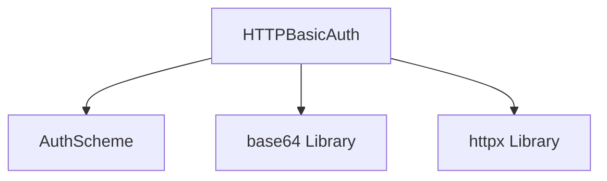

# http_basic_authentication

## Introduction

The `http_basic_authentication` module provides the implementation for HTTP Basic authentication within the CrewAI's agent-to-agent (A2A) communication framework. It allows client agents to authenticate with services or other agents using a username and password, adhering to the standard HTTP Basic authentication scheme.

## Architecture and Component Relationships

This module contains the `HTTPBasicAuth` class, which is a concrete implementation of a client authentication scheme. It integrates with the broader A2A authentication system and relies on standard Python libraries for encoding credentials.

<!-- DIAGRAM_JSON
{
    "direction": "TD",
    "nodes": [
        {"id": "http_basic_auth", "label": "HTTPBasicAuth", "type": "component", "link": null},
        {"id": "client_auth_scheme", "label": "AuthScheme", "type": "external", "link": "base_client_auth_scheme.md"},
        {"id": "base64", "label": "base64 Library", "type": "external", "link": null},
        {"id": "httpx", "label": "httpx Library", "type": "external", "link": null}
    ],
    "edges": [
        {"source": "http_basic_auth", "target": "client_auth_scheme"},
        {"source": "http_basic_auth", "target": "base64"},
        {"source": "http_basic_auth", "target": "httpx"}
    ],
    "groups": []
}
-->



## Core Functionality

The `HTTPBasicAuth` class manages the process of generating and applying HTTP Basic authentication headers to outgoing requests. It encapsulates the logic for encoding the username and password into the `Authorization` header.

### `HTTPBasicAuth` Class

```python
class HTTPBasicAuth(ClientAuthScheme):
    """HTTP Basic authentication.

    Attributes:
        username: Username for Basic authentication.
        password: Password for Basic authentication.
    """

    username: str = Field(description="Username")
    password: str = Field(description="Password")

    async def apply_auth(
        self, client: httpx.AsyncClient, headers: MutableMapping[str, str]
    ) -> MutableMapping[str, str]:
        """Apply HTTP Basic authentication.

        Args:
            client: HTTP client for making auth requests.
            headers: Current request headers.

        Returns:
            Updated headers with Basic auth in Authorization header.
        """
        credentials = f"{self.username}:{self.password}"
        encoded = base64.b64encode(credentials.encode()).decode()
        headers["Authorization"] = f"Basic {encoded}"
        return headers
```

- **`username` and `password`**: These attributes store the credentials required for basic authentication.
- **`apply_auth(client, headers)`**: This asynchronous method is responsible for constructing the `Authorization` header. It combines the `username` and `password`, Base64 encodes them, and then adds the `Basic` scheme prefix before setting the header. The updated headers are then returned.

## Integration with the Overall System

The `http_basic_authentication` module is a vital part of the `crewai_agent_to_agent_communication` module, specifically within the `basic_client_auth` sub-module. It provides a standardized and secure way for CrewAI agents to interact with external services or other agents that use HTTP Basic authentication. By implementing the `ClientAuthScheme` interface, `HTTPBasicAuth` ensures consistent integration with other client authentication mechanisms, allowing for flexible and robust authentication strategies across the CrewAI ecosystem. This modular design promotes extensibility, enabling the easy addition of new authentication methods without disrupting existing functionalities.
