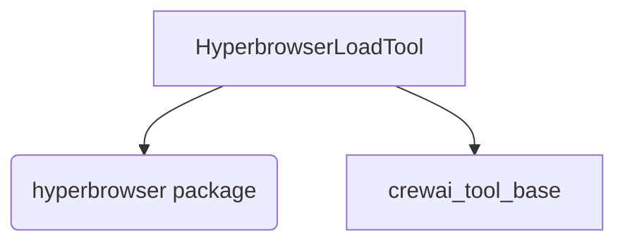

# hyperbrowser_integration Module Documentation

## Introduction

The `hyperbrowser_integration` module provides a specialized tool for interacting with the Hyperbrowser API, enabling advanced web scraping and crawling capabilities within the CrewAI framework. It offers a convenient way to extract structured content from web pages, supporting both single-page scraping and multi-page crawling operations.

## Module Purpose and Core Functionality

This module's primary purpose is to integrate Hyperbrowser's web data extraction services into CrewAI. The core functionality revolves around the `HyperbrowserLoadTool` which allows agents to:

*   **Scrape Web Pages**: Extract content from a specified URL.
*   **Crawl Websites**: Navigate and extract content from multiple pages within a domain.
*   **Content Formatting**: Retrieve extracted data in either Markdown or HTML format.
*   **Configurable Extraction**: Apply various Hyperbrowser session and scrape options for fine-grained control over the extraction process.

## Architecture and Component Relationships

The `hyperbrowser_integration` module is a leaf module within the `crewai_tools_web_scraping` package. Its main component is `HyperbrowserLoadTool`, which inherits from `BaseTool` (defined in [crewai_tool_base.md](crewai_tool_base.md)). This design ensures consistency with other tools in the CrewAI ecosystem and leverages the foundational capabilities provided by the `BaseTool` class.

### Core Components

#### `HyperbrowserLoadTool`

-   **Description**: A specialized CrewAI tool that utilizes the Hyperbrowser API to scrape or crawl web pages. It handles API key management, request parameter preparation, and content extraction from Hyperbrowser responses.
-   **Dependencies**:
    -   `hyperbrowser` (external Python package): Used for all interactions with the Hyperbrowser API.
    -   `BaseTool` (from [crewai_tool_base.md](crewai_tool_base.md)): Provides the fundamental structure and interface for CrewAI tools.
    -   `pydantic.BaseModel` and `pydantic.Field`: For defining the tool's arguments schema and managing package dependencies.

## How the Module Fits into the Overall System

The `hyperbrowser_integration` module enhances the web interaction capabilities of CrewAI agents by providing a robust and flexible way to gather information from the internet. As part of `crewai_tools_web_scraping`, it serves as a powerful option for agents requiring programmatic access to web content, complementing other web scraping tools available in the framework. This module is particularly useful for tasks that involve data collection, research, and content analysis from various web sources.

## Diagrams

<!-- DIAGRAM_JSON
{
    "direction": "TD",
    "nodes": [
        {"id": "hyperbrowser_load_tool", "label": "HyperbrowserLoadTool", "type": "component", "link": null},
        {"id": "hyperbrowser_package", "label": "hyperbrowser (package)", "type": "external", "link": null},
        {"id": "crewai_tool_base", "label": "crewai_tool_base", "type": "external", "link": "crewai_tool_base.md"}
    ],
    "edges": [
        {"source": "hyperbrowser_load_tool", "target": "hyperbrowser_package"},
        {"source": "hyperbrowser_load_tool", "target": "crewai_tool_base"}
    ],
    "groups": []
}
-->
