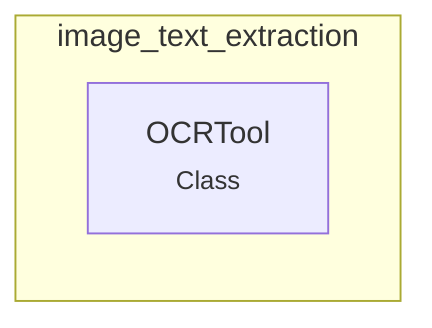

# image_text_extraction
The `image_text_extraction` module offers the `OCRTool`, a powerful component designed for Optical Character Recognition. It utilizes LLMs to accurately extract text from images, supporting both local files and remote URLs.

<!-- DIAGRAM_JSON
{
    "nodes": [
        {
            "id": "image_text_extraction",
            "label": "image_text_extraction",
            "type": "module"
        },
        {
            "id": "OCRTool",
            "label": "OCRTool",
            "type": "class"
        }
    ],
    "edges": [
        {
            "source": "image_text_extraction",
            "target": "OCRTool",
            "type": "contains"
        }
    ],
    "groups": [
        {
            "id": "image_text_extraction_group",
            "label": "image_text_extraction",
            "nodes": [
                "OCRTool"
            ]
        }
    ]
}
-->
