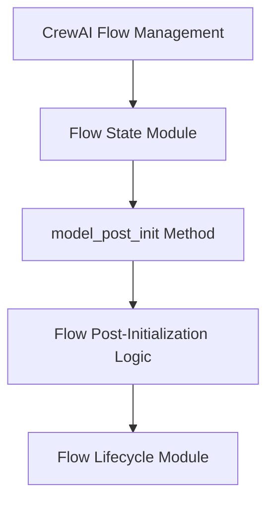

# Module: `initialization_hooks`

## Introduction
The `initialization_hooks` module is a crucial part of the CrewAI Flow Management system, specifically nested within the `flow_state` sub-module. Its primary responsibility is to define and execute post-initialization logic for `Flow` objects, ensuring that all necessary setup and configurations are applied immediately after a flow model has been instantiated. This module acts as a hook, allowing for custom initialization routines to be seamlessly integrated into the flow's lifecycle.

## Purpose and Core Functionality
The core purpose of the `initialization_hooks` module is to provide a standardized mechanism for performing actions immediately after a `Flow` object is initialized. This is achieved through the `model_post_init` method, which is automatically invoked post-instantiation of a Pydantic model. Within this module, `model_post_init` triggers an internal `_flow_post_init()` method, which encapsulates the actual initialization logic specific to the flow.

### Core Component: `model_post_init`
- **`lib.crewai.src.crewai.flow.flow.model_post_init`**: This method serves as the entry point for all post-initialization actions within a `Flow`. It ensures that any required setup, state adjustments, or dependency injections are handled before the flow becomes fully operational. This could include, but is not limited to, setting up listeners, initializing internal components, or validating the flow's initial state.

## Architecture and Component Relationships

<!-- DIAGRAM_JSON
{
    "direction": "TD",
    "nodes": [
        {"id": "model_post_init_method", "label": "model_post_init Method", "type": "component", "link": null},
        {"id": "flow_post_init_logic", "label": "Flow Post-Initialization Logic", "type": "component", "link": null},
        {"id": "flow_state", "label": "Flow State Module", "type": "external", "link": "flow_state.md"},
        {"id": "flow_lifecycle", "label": "Flow Lifecycle Module", "type": "external", "link": "flow_lifecycle.md"},
        {"id": "crewai_flow_management", "label": "CrewAI Flow Management", "type": "external", "link": "crewai_flow_management.md"}
    ],
    "edges": [
        {"source": "model_post_init_method", "target": "flow_post_init_logic"},
        {"source": "flow_state", "target": "model_post_init_method"},
        {"source": "flow_post_init_logic", "target": "flow_lifecycle"},
        {"source": "crewai_flow_management", "target": "flow_state"}
    ],
    "groups": []
}
-->

### Component Breakdown:
*   **`model_post_init_method`**: This represents the `model_post_init` method, which is automatically called by Pydantic after a `Flow` instance is created. It acts as the primary hook for all initial setup.
*   **`flow_post_init_logic`**: This refers to the internal `_flow_post_init()` function invoked by `model_post_init_method`. It encapsulates the specific business logic required for the flow's initial setup.

### External Dependencies:
*   **`flow_state`**: The `initialization_hooks` module is a sub-module of `flow_state`. It relies on `flow_state` to provide the context and overall management of a flow's data and runtime information. For more details, refer to [flow_state.md](flow_state.md).
*   **`flow_lifecycle`**: The `flow_post_init_logic` often involves setting up aspects related to the flow's lifecycle, such as event listeners or initial state transitions. This indicates an interaction with the `flow_lifecycle` module, which manages the various stages and transitions of a flow's execution. For more details, refer to [flow_lifecycle.md](flow_lifecycle.md).
*   **`crewai_flow_management`**: This is the overarching module that orchestrates the entire flow system. `initialization_hooks` is an integral part of this broader system, ensuring that individual flows are correctly set up within the larger framework. For more details, refer to [crewai_flow_management.md](crewai_flow_management.md).

## How the Module Fits into the Overall System
The `initialization_hooks` module plays a vital role in the `CrewAI` system by guaranteeing the proper setup of `Flow` instances. It is invoked early in the flow's existence, right after instantiation, making it critical for:
1.  **Ensuring Consistency**: All `Flow` objects are initialized consistently with baseline requirements.
2.  **Preparing for Execution**: Necessary components and configurations are in place before a flow begins its execution, interfacing with modules like `flow_lifecycle` to prepare the flow for its operational stages.
3.  **Encapsulating Setup Logic**: It centralizes the initialization logic, making `Flow` creation cleaner and more robust.

This module ensures that any new `Flow` or a reloaded `Flow` (if `_flow_post_init` is called on reload) starts in a valid and ready state, contributing to the overall stability and predictability of the `CrewAI` agents and their interactions.
