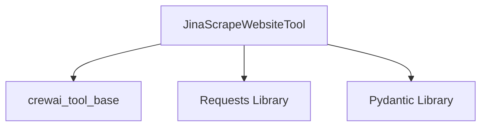

# `jina_integration` Module Documentation

The `jina_integration` module provides a specialized tool for integrating Jina.ai's website scraping capabilities into the CrewAI ecosystem. It enables agents to efficiently extract content from websites, leveraging Jina.ai's reader service to convert web pages into a clean, markdown format.

## Architecture and Core Components

The `jina_integration` module is centered around the `JinaScrapeWebsiteTool` component, which serves as the primary interface for interacting with the Jina.ai scraping service.

### `JinaScrapeWebsiteTool`

- **Purpose:** This tool is designed to scrape the content of a given website URL using the Jina.ai reader API. It fetches the website's content and returns it in a markdown format, making it easy for agents to process and understand.
- **Functionality:**
    - Initializes with an optional `website_url`, `api_key`, and `custom_headers`.
    - Automatically updates its description based on the provided `website_url` for better clarity in agent interactions.
    - Uses a `requests` library to make HTTP GET requests to the Jina.ai reader endpoint (`https://r.jina.ai/{url}`).
    - Handles API key authentication by including it in the `Authorization` header.
    - Ensures that a `website_url` is provided either during initialization or at the time of execution.
    - Raises an HTTP error for unsuccessful responses from the Jina.ai API.
- **Dependencies:**
    - `BaseTool` from the [crewai_tool_base](crewai_tool_base.md) module: Provides the foundational structure for CrewAI tools.
    - `BaseModel` and `Field` from `pydantic`: Used for defining the tool's input schema and validating arguments.
    - `requests` (external library): For making HTTP requests to the Jina.ai service.

## Module Relationships

The `jina_integration` module is a leaf module within the `crewai_tools_web_scraping` package, specifically focused on a particular web scraping technology. It provides a direct utility for agents needing to scrape web content through Jina.ai, complementing other web scraping tools available in the system.

<!-- DIAGRAM_JSON
{
    "direction": "TD",
    "nodes": [
        {"id": "jina_scrape_website_tool", "label": "JinaScrapeWebsiteTool", "type": "component", "link": null},
        {"id": "crewai_tool_base", "label": "crewai_tool_base", "type": "external", "link": "crewai_tool_base.md"},
        {"id": "requests", "label": "Requests Library", "type": "external", "link": null},
        {"id": "pydantic", "label": "Pydantic Library", "type": "external", "link": null}
    ],
    "edges": [
        {"source": "jina_scrape_website_tool", "target": "crewai_tool_base"},
        {"source": "jina_scrape_website_tool", "target": "requests"},
        {"source": "jina_scrape_website_tool", "target": "pydantic"}
    ],
    "groups": []
}
-->

