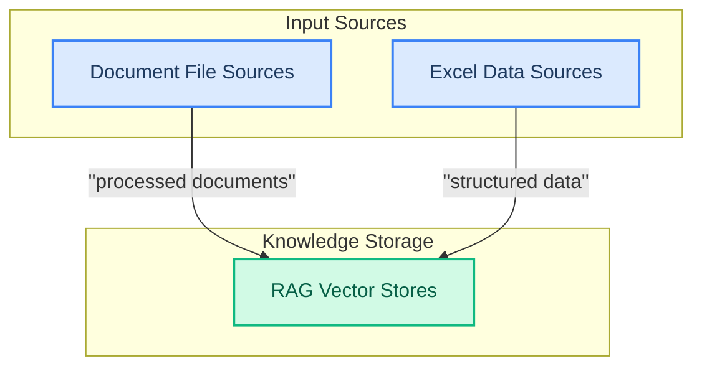

# Knowledge Sources
This module provides a unified interface for integrating diverse knowledge sources, enabling agents to retrieve and utilize information from various file types like documents and spreadsheets.
<!-- DIAGRAM_JSON
{
    "direction": "TD",
    "nodes": [
        {"id": "document_file_sources", "label": "Document File Sources", "type": "module", "link": "document_file_sources.md"},
        {"id": "excel_data_sources", "label": "Excel Data Sources", "type": "module", "link": "excel_data_sources.md"},
        {"id": "rag_vector_stores", "label": "RAG Vector Stores", "type": "module", "link": "rag_vector_stores.md"}
    ],
    "edges": [
        {"source": "document_file_sources", "target": "rag_vector_stores", "label": "processed documents"},
        {"source": "excel_data_sources", "target": "rag_vector_stores", "label": "structured data"}
    ],
    "groups": [
        {"id": "input_sources", "label": "Input Sources", "role": "surface", "nodes": ["document_file_sources", "excel_data_sources"]},
        {"id": "knowledge_storage", "label": "Knowledge Storage", "role": "data", "nodes": ["rag_vector_stores"]}
    ]
}
-->
