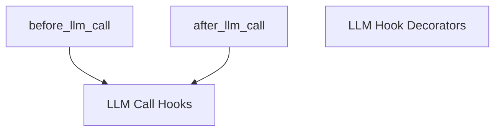

# `llm_call_decorators` Module Documentation

## Introduction

The `llm_call_decorators` module provides powerful decorators to inject custom logic before and after Large Language Model (LLM) calls within the CrewAI framework. These decorators allow developers to easily extend and modify the behavior of LLM interactions without altering the core LLM integration code, promoting clean architecture and enhanced observability.

## Purpose and Core Functionality

This module's primary purpose is to offer a standardized and declarative way to hook into the LLM call lifecycle. By using these decorators, developers can implement cross-cutting concerns such as logging, input/output sanitization, caching, performance monitoring, or custom pre-processing and post-processing steps directly within their agent definitions.

### `before_llm_call` Decorator

The `before_llm_call` decorator registers a function to be executed **before** an LLM call is made. This is particularly useful for:
- **Logging**: Recording details about the upcoming LLM request.
- **Pre-processing**: Modifying the context or input before it's sent to the LLM.
- **Validation**: Ensuring that inputs meet certain criteria.
- **Security**: Redacting sensitive information before the call.

It can optionally be filtered to apply only to specific agents, allowing for fine-grained control over which LLM calls trigger the hook.

### `after_llm_call` Decorator

The `after_llm_call` decorator registers a function to be executed **after** an LLM call has completed and a response has been received. Its applications include:
- **Logging**: Recording LLM responses or performance metrics.
- **Post-processing**: Transforming or enriching the LLM's output.
- **Sanitization**: Removing or replacing sensitive information from the LLM's response.
- **Error Handling**: Custom logic for handling specific types of LLM responses or errors.

Similar to `before_llm_call`, this decorator also supports agent-based filtering.

## Architecture and Component Relationships

The `llm_call_decorators` module is a leaf module within the broader [crewai_hooks_system](crewai_hooks_system.md). It specifically focuses on LLM-related hooks, sitting alongside [tool_call_decorators](tool_call_decorators.md) within [llm_hook_decorators](llm_hook_decorators.md).

Both `before_llm_call` and `after_llm_call` leverage an internal `_create_hook_decorator` utility (not directly exposed) for common decorator logic. Crucially, they interact with the [llm_call_hooks](llm_call_hooks.md) module (which is part of [llm_hook_wrappers](llm_hook_wrappers.md)) to register the actual hook functions into the CrewAI's hook management system. This separation of concerns ensures that the decorators are focused on providing a convenient API, while the `llm_call_hooks` module handles the underlying registration and execution of these hooks.

<!-- DIAGRAM_JSON
{
    "direction": "TD",
    "nodes": [
        {"id": "before_llm_call", "label": "before_llm_call", "type": "component", "link": null},
        {"id": "after_llm_call", "label": "after_llm_call", "type": "component", "link": null},
        {"id": "llm_call_hooks", "label": "LLM Call Hooks", "type": "external", "link": "llm_call_hooks.md"},
        {"id": "llm_hook_decorators", "label": "LLM Hook Decorators", "type": "external", "link": "llm_hook_decorators.md"}
    ],
    "edges": [
        {"source": "before_llm_call", "target": "llm_call_hooks"},
        {"source": "after_llm_call", "target": "llm_call_hooks"}
    ],
    "groups": []
}
-->

## How the Module Fits into the Overall System

The `llm_call_decorators` module plays a vital role in the extensibility and customizability of the CrewAI framework. It is an integral part of the broader [crewai_hooks_system](crewai_hooks_system.md), which enables developers to inject custom logic at various key points in an agent's execution flow.

By providing specific decorators for LLM interactions, this module allows developers to:
- **Enhance Observability**: Easily log all LLM inputs and outputs for debugging, auditing, or analytical purposes.
- **Implement Custom Security Policies**: Automatically redact or sanitize sensitive data before it reaches an LLM or before its response is processed.
- **Streamline Workflows**: Automate pre-computation or post-processing steps directly tied to LLM calls.
- **Improve Agent Robustness**: Add validation layers to ensure LLM interactions adhere to specific requirements.

This module contributes to a more flexible and robust CrewAI ecosystem, allowing agents to be tailored precisely to the needs of complex applications and enterprise environments. It abstracts away the complexities of hook registration, providing a clean and Pythonic way to extend agent behavior.