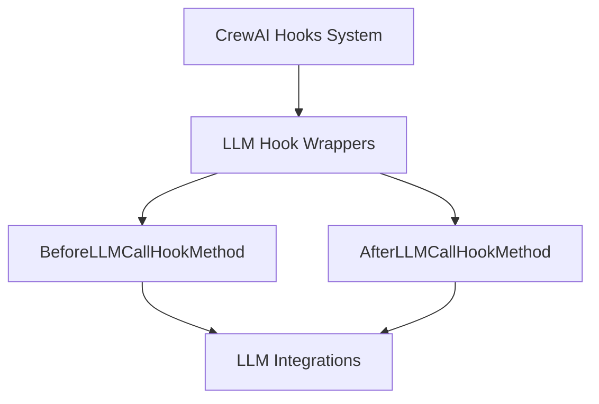

# llm_call_hooks Module Documentation

## Introduction

The `llm_call_hooks` module is a vital part of the CrewAI framework, specifically designed to provide a robust mechanism for intercepting and modifying the behavior of Large Language Model (LLM) calls. It defines standardized wrappers for methods that need to execute logic *before* or *after* an LLM interaction, allowing for enhanced observability, control, and extensibility of agent behaviors.

This module sits within the broader [crewai_hooks_system](crewai_hooks_system.md), acting as the specialized layer for LLM-specific interception points.

## Purpose and Core Functionality

The primary purpose of `llm_call_hooks` is to enable developers to define custom logic that automatically runs at specific points during an LLM's invocation. This is crucial for implementing features such as:

*   **Pre-processing prompts:** Modifying or enriching prompts before they are sent to the LLM.
*   **Post-processing responses:** Analyzing, filtering, or reformatting responses received from the LLM.
*   **Logging and Monitoring:** Recording LLM inputs, outputs, and performance metrics.
*   **Security and Compliance:** Implementing checks on data flowing to and from LLMs.
*   **Dynamic Configuration:** Adjusting LLM parameters based on context.

The module achieves this through two core components:

### BeforeLLMCallHookMethod

This class acts as a wrapper for methods intended to be executed *before* an LLM call is made. When a method within a `@CrewBase` class is decorated as a `before_llm_call` hook, it is wrapped by `BeforeLLMCallHookMethod`. This wrapper ensures that the method can be correctly identified, registered, and invoked by the [crewai_hooks_system](crewai_hooks_system.md) at the appropriate time.

*   **Key Attributes:**
    *   `is_before_llm_call_hook`: A boolean flag set to `True` for identification.
    *   `agents`: An optional list of agent roles, allowing the hook to be selectively applied to specific agents.

### AfterLLMCallHookMethod

Similar to `BeforeLLMCallHookMethod`, this class wraps methods designed to run *after* an LLM call has completed. It enables post-processing of LLM responses, allowing for transformations, validations, or further actions based on the LLM's output. Like its counterpart, it supports selective application based on agent roles.

*   **Key Attributes:**
    *   `is_after_llm_call_hook`: A boolean flag set to `True` for identification.
    *   `agents`: An optional list of agent roles for targeted hook execution.

Both wrappers leverage Python's descriptor protocol (`__get__` method) to ensure that the wrapped methods behave correctly whether accessed through a class or an instance, making them suitable for instance-specific logic.

## Architecture and Component Relationships

The `llm_call_hooks` module provides the foundational wrappers for LLM-specific hooks. These wrappers (`BeforeLLMCallHookMethod` and `AfterLLMCallHookMethod`) are instantiated when `crewai_hooks_system` discovers methods decorated as hooks within `CrewBase` classes. They then serve as the callable entry points for custom logic, interjecting themselves around interactions with the [crewai_llm_integrations](crewai_llm_integrations.md) module.

<!-- DIAGRAM_JSON
{
    "direction": "TD",
    "nodes": [
        {"id": "before_hook", "label": "BeforeLLMCallHookMethod", "type": "component", "link": null},
        {"id": "after_hook", "label": "AfterLLMCallHookMethod", "type": "component", "link": null},
        {"id": "llm_wrappers_mod", "label": "LLM Hook Wrappers", "type": "external", "link": "llm_hook_wrappers.md"},
        {"id": "hooks_system_mod", "label": "CrewAI Hooks System", "type": "external", "link": "crewai_hooks_system.md"},
        {"id": "llm_integrations_mod", "label": "LLM Integrations", "type": "external", "link": "crewai_llm_integrations.md"}
    ],
    "edges": [
        {"source": "llm_wrappers_mod", "target": "before_hook"},
        {"source": "llm_wrappers_mod", "target": "after_hook"},
        {"source": "before_hook", "target": "llm_integrations_mod"},
        {"source": "after_hook", "target": "llm_integrations_mod"},
        {"source": "hooks_system_mod", "target": "llm_wrappers_mod"}
    ],
    "groups": []
}
-->

## How the Module Fits into the Overall System

`llm_call_hooks` is a specialized sub-module within [llm_hook_wrappers](llm_hook_wrappers.md), which itself is a part of the larger [crewai_hooks_system](crewai_hooks_system.md). This hierarchy ensures a clear separation of concerns, with `llm_call_hooks` focusing solely on the mechanics of wrapping LLM-related hook methods.

It plays a critical role in the CrewAI ecosystem by providing the underlying mechanism for custom logic execution during agent decision-making and task execution that involves LLMs. By interacting with [crewai_llm_integrations](crewai_llm_integrations.md), it allows for a flexible and powerful way to extend and observe the behavior of agents powered by various LLM providers without directly modifying the core LLM integration code. This promotes modularity, testability, and maintainability of the CrewAI framework.