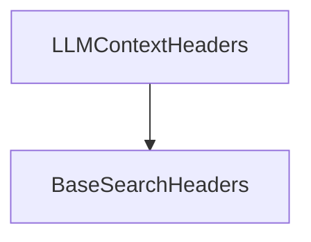

# `llm_context_headers_module`

The `llm_context_headers_module` module defines the data structure for geographical location headers used specifically with the Brave LLM Context endpoint.

## Module Overview

This module's primary role is to provide a standardized way to pass user location information (latitude, longitude, city, state, country) in requests to the Brave LLM Context API. By encapsulating these parameters within a dedicated header class, it ensures consistency and ease of use when integrating location-aware features into tools that interact with Brave's LLM services.

## Architecture and Component Relationships

The `llm_context_headers_module` contains the `LLMContextHeaders` class, which extends `BaseSearchHeaders` from the `search_api_schemas` module. This inheritance signifies that `LLMContextHeaders` adheres to a common structure for search-related headers while adding specific fields pertinent to LLM context and location.

<!-- DIAGRAM_JSON
{
    "direction": "TD",
    "nodes": [
        {"id": "llm_context_headers", "label": "LLMContextHeaders", "type": "component", "link": null},
        {"id": "base_search_headers", "label": "BaseSearchHeaders", "type": "external", "link": "search_api_schemas.md"}
    ],
    "edges": [
        {"source": "llm_context_headers", "target": "base_search_headers"}
    ],
    "groups": []
}
-->

### `LLMContextHeaders` Component

`LLMContextHeaders` is a Pydantic model designed to hold geographical location data. Each field is mapped to a specific header (`x-loc-*`) required by the Brave LLM Context endpoint.

**Fields:**

*   `x_loc_lat` (float | None): Latitude of the user's location (alias `x-loc-lat`). Valid range: -90.0 to 90.0.
*   `x_loc_long` (float | None): Longitude of the user's location (alias `x-loc-long`). Valid range: -180.0 to 180.0.
*   `x_loc_city` (str | None): City of the user's location (alias `x-loc-city`).
*   `x_loc_state` (str | None): State of the user's location (alias `x-loc-state`).
*   `x_loc_state_name` (str | None): Full name of the state of the user's location (alias `x-loc-state-name`).
*   `x_loc_country` (str | None): ISO 3166-1 alpha-2 country code of the user's location (alias `x-loc-country`).

## Integration with the Overall System

This module is a sub-module within `crewai_tools_web_search.search_api_schemas.location_search_headers`. It specifically serves the Brave Search Tool by providing the necessary structure for sending location-based context to Brave's LLM. This allows search queries or LLM interactions to be geographically localized, leading to more relevant and context-aware results. Its integration point would primarily be within components responsible for making API calls to Brave's services, where an instance of `LLMContextHeaders` would be serialized into request headers.