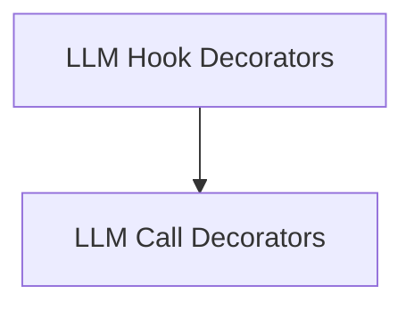

# llm_hook_decorators

The `llm_hook_decorators` module provides a flexible way to register functions that execute before or after calls to Language Model (LLM) services within the CrewAI framework. These decorators enable developers to easily inject custom logic for monitoring, logging, modifying requests, or processing responses, all while supporting filtering based on the agents involved.

## Architecture Overview

The `llm_hook_decorators` module is part of the larger CrewAI hooks system. It specifically focuses on providing an easy-to-use interface for defining and registering callbacks related to LLM interactions. It leverages a shared underlying hook registration mechanism to manage and execute the decorated functions at appropriate points in the LLM call lifecycle.

<!-- DIAGRAM_JSON
{
    "direction": "TD",
    "nodes": [
        {"id": "llm_hook_decorators", "label": "LLM Hook Decorators", "type": "module"},
        {"id": "llm_call_decorators", "label": "LLM Call Decorators", "type": "module", "link": "llm_call_decorators.md"}
    ],
    "edges": [
        {"source": "llm_hook_decorators", "target": "llm_call_decorators"}
    ],
    "groups": []
}
-->

## Sub-modules

### LLM Call Decorators
The `llm_call_decorators` sub-module contains the core decorators, `before_llm_call` and `after_llm_call`, which allow functions to be registered for execution at specific points during an LLM's operation. These decorators offer functionality to apply custom logic or modifications to LLM interactions, optionally filtering by specific agents.
For more details, refer to the [LLM Call Decorators documentation](llm_call_decorators.md).
