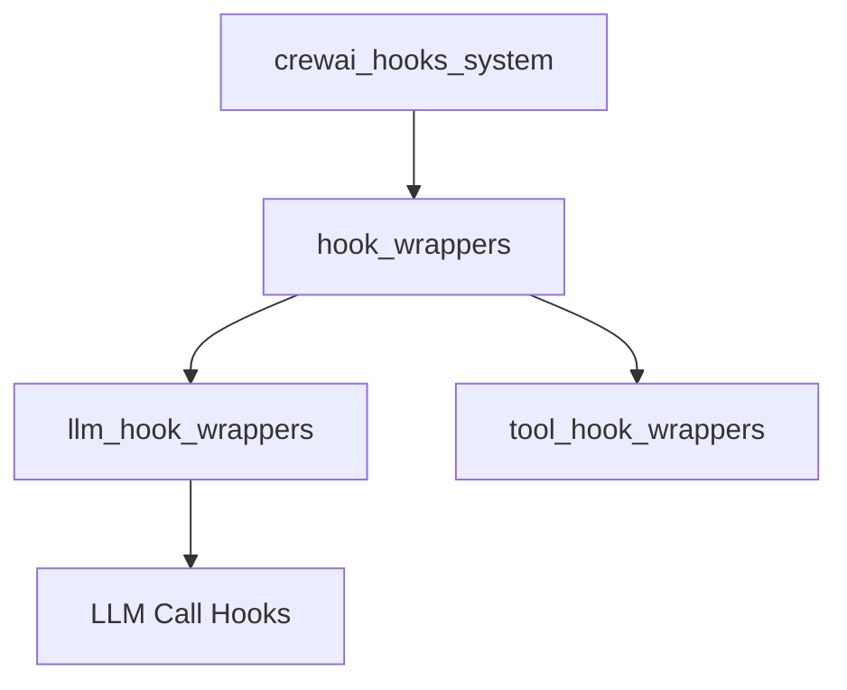

# llm_hook_wrappers Module Documentation

## Introduction

The `llm_hook_wrappers` module is a crucial part of the CrewAI's hooks system, providing mechanisms to inject custom logic before and after interactions with Language Model Managers (LLMs). This allows developers to implement monitoring, logging, data manipulation, or any other custom behavior around LLM calls within their CrewAI agents.

## Architecture Overview

The `llm_hook_wrappers` module resides within the `crewai_hooks_system` and specifically under the `hook_wrappers` sub-module. It works in conjunction with other hook-related modules like `tool_hook_wrappers` to offer a comprehensive hooking capability for various agent operations.

It contains the core logic for defining and managing LLM-specific hooks, ensuring that custom functions can be seamlessly integrated into the LLM interaction lifecycle.

## Sub-modules

- [LLM Call Hooks](llm_call_hooks.md): Manages the execution of custom logic before and after LLM calls.

<!-- DIAGRAM_JSON
{
    "direction": "TD",
    "nodes": [
        {"id": "crewai_hooks_system", "label": "crewai_hooks_system", "type": "module", "link": "crewai_hooks_system.md"},
        {"id": "hook_wrappers", "label": "hook_wrappers", "type": "module", "link": "hook_wrappers.md"},
        {"id": "llm_hook_wrappers", "label": "llm_hook_wrappers", "type": "module", "link": "llm_hook_wrappers.md"},
        {"id": "tool_hook_wrappers", "label": "tool_hook_wrappers", "type": "module", "link": "tool_hook_wrappers.md"},
        {"id": "llm_call_hooks", "label": "LLM Call Hooks", "type": "module", "link": "llm_call_hooks.md"}
    ],
    "edges": [
        {"source": "crewai_hooks_system", "target": "hook_wrappers"},
        {"source": "hook_wrappers", "target": "llm_hook_wrappers"},
        {"source": "hook_wrappers", "target": "tool_hook_wrappers"},
        {"source": "llm_hook_wrappers", "target": "llm_call_hooks"}
    ],
    "groups": []
}
-->

