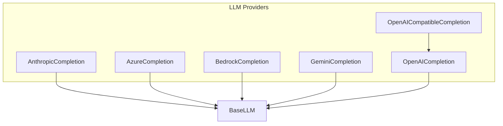

# llm_integrations
This module provides native integrations for various Large Language Models (LLMs) from providers like Anthropic, Azure, Bedrock, Gemini, OpenAI, and OpenAI-compatible services, built upon a common `BaseLLM` for consistent interaction.

<!-- DIAGRAM_JSON
{
    "nodes": [
        {
            "id": "BaseLLM",
            "label": "BaseLLM"
        },
        {
            "id": "Anthropic",
            "label": "AnthropicCompletion"
        },
        {
            "id": "Azure",
            "label": "AzureCompletion"
        },
        {
            "id": "Bedrock",
            "label": "BedrockCompletion"
        },
        {
            "id": "Gemini",
            "label": "GeminiCompletion"
        },
        {
            "id": "OpenAI",
            "label": "OpenAICompletion"
        },
        {
            "id": "OpenAICompatible",
            "label": "OpenAICompatibleCompletion"
        }
    ],
    "edges": [
        {
            "source": "Anthropic",
            "target": "BaseLLM"
        },
        {
            "source": "Azure",
            "target": "BaseLLM"
        },
        {
            "source": "Bedrock",
            "target": "BaseLLM"
        },
        {
            "source": "Gemini",
            "target": "BaseLLM"
        },
        {
            "source": "OpenAI",
            "target": "BaseLLM"
        },
        {
            "source": "OpenAICompatible",
            "target": "OpenAI"
        }
    ],
    "groups": []
}
-->
