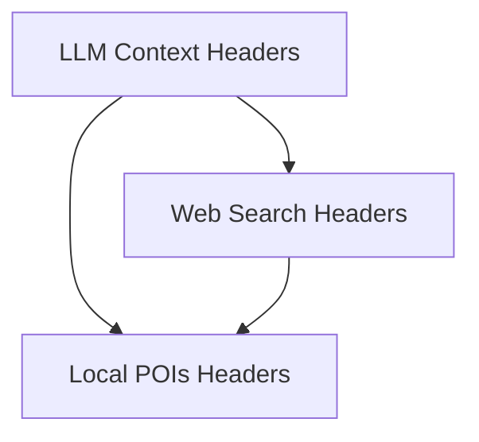

# Location Search Headers Module

## Introduction

The `location_search_headers` module is a crucial component within the `crewai_tools_web_search.search_api_schemas` package, responsible for defining the necessary HTTP headers that incorporate location-based information for various Brave Search API endpoints. This module ensures that search queries can be finely tuned with geographical context, enabling more relevant and localized search results for LLM context, local Points of Interest (POIs), and general web searches.

## Architecture Overview

The module is structured into distinct header classes, each tailored to specific Brave Search functionalities. These classes inherit from a `BaseSearchHeaders` (not explicitly shown in provided components but implied by usage), providing a consistent foundation for all location-aware headers.

<!-- DIAGRAM_JSON
{
    "direction": "TD",
    "nodes": [
        {"id": "llm_context_headers_module", "label": "LLM Context Headers", "type": "module", "link": "llm_context_headers_module.md"},
        {"id": "local_pois_headers_module", "label": "Local POIs Headers", "type": "module", "link": "local_pois_headers_module.md"},
        {"id": "web_search_headers_module", "label": "Web Search Headers", "type": "module", "link": "web_search_headers_module.md"}
    ],
    "edges": [
        {"source": "llm_context_headers_module", "target": "web_search_headers_module"}
    ],
    "groups": []
}
-->

## Sub-modules

This module comprises the following sub-modules, each focusing on a particular set of location-related headers:

*   **[LLM Context Headers](llm_context_headers_module.md)**: This sub-module defines the `LLMContextHeaders` class, which is used to provide detailed geographical information (latitude, longitude, city, state, country) when interacting with Brave Search's LLM Context endpoint.

*   **[Local POIs Headers](local_pois_headers_module.md)**: This sub-module contains the `LocalPOIsHeaders` class, specifically designed for Brave Search's Local POIs endpoint, focusing on precise latitude and longitude coordinates.

*   **[Web Search Headers](web_search_headers_module.md)**: This sub-module provides the `WebSearchHeaders` class, which offers a comprehensive set of location headers (including latitude, longitude, timezone, city, state, country, and postal code) for general web search queries through Brave Search.