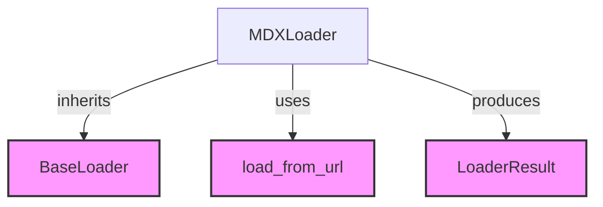

# Module: `markup_loaders`

## Introduction
The `markup_loaders` module is a specialized component within the `crewai_tools` RAG (Retrieval Augmented Generation) system, specifically designed to handle the loading and parsing of markup language content, with a primary focus on MDX (Markdown with JSX) files. Its main purpose is to extract clean, readable text from structured markup, making it suitable for further processing within a RAG pipeline.

## Architecture and Component Relationships

The `markup_loaders` module contains the `MDXLoader` component, which is responsible for the core functionality. It leverages external components for base loading functionality and web content retrieval.

<!-- DIAGRAM_JSON
{
    "direction": "TD",
    "nodes": [
        {"id": "mdx_loader", "label": "MDXLoader", "type": "component", "link": null},
        {"id": "base_loader", "label": "BaseLoader", "type": "external", "link": "crewai_tools_rag_loaders_and_chunkers_base_components.md"},
        {"id": "load_from_url", "label": "load_from_url", "type": "external", "link": "crewai_tools_rag_loaders_and_chunkers_data_loaders_web_loaders_general_web_content_loaders.md"},
        {"id": "loader_result", "label": "LoaderResult", "type": "external", "link": "crewai_tools_rag_loaders_and_chunkers_base_components.md"}
    ],
    "edges": [
        {"source": "mdx_loader", "target": "base_loader", "label": "inherits"},
        {"source": "mdx_loader", "target": "load_from_url", "label": "uses"},
        {"source": "mdx_loader", "target": "loader_result", "label": "produces"}
    ],
    "groups": []
}
-->



### Core Components

#### `MDXLoader`
The `MDXLoader` class is the primary component of this module. It extends `BaseLoader` and provides methods for loading MDX content from various sources (URLs and local files) and parsing it into a clean text format.

**Key Responsibilities:**
*   **Content Loading**: Retrieves MDX content from a given `SourceContent` object, supporting both remote URLs and local file paths. For URL-based content, it utilizes the `load_from_url` utility.
*   **MDX Parsing**: Strips out MDX-specific syntax, including `import` and `export` statements, and JSX tags, to extract the plain textual content. It also cleans up extra whitespace.
*   **Metadata Generation**: Attaches relevant metadata, such as the format (`mdx`), original source reference, and a unique document ID, to the processed content.

**Usage:**
The `load` method takes a `SourceContent` object and returns a `LoaderResult` containing the cleaned content and associated metadata.

```python
class MDXLoader(BaseLoader):
    def load(self, source_content: SourceContent, **kwargs: Any) -> LoaderResult:  # type: ignore[override]
        source_ref = source_content.source_ref
        content = source_content.source

        if source_content.is_url():
            content = load_from_url(
                source_ref,
                kwargs,
                accept_header="text/markdown, text/x-markdown, text/plain",
                loader_name="MDXLoader",
            )
        elif source_content.path_exists():
            content = self._load_from_file(source_ref)

        return self._parse_mdx(content, source_ref)

    @staticmethod
    def _load_from_file(path: str) -> str:
        with open(path, encoding="utf-8") as file:
            return file.read()

    def _parse_mdx(self, content: str, source_ref: str) -> LoaderResult:
        cleaned_content = content

        # Remove import statements
        cleaned_content = _IMPORT_PATTERN.sub("", cleaned_content)

        # Remove export statements
        cleaned_content = _EXPORT_PATTERN.sub("", cleaned_content)

        # Remove JSX tags (simple approach)
        cleaned_content = _JSX_TAG_PATTERN.sub("", cleaned_content)

        # Clean up extra whitespace
        cleaned_content = _EXTRA_NEWLINES_PATTERN.sub("

", cleaned_content)
        cleaned_content = cleaned_content.strip()

        metadata = {"format": "mdx"}
        return LoaderResult(
            content=cleaned_content,
            source=source_ref,
            metadata=metadata,
            doc_id=self.generate_doc_id(source_ref=source_ref, content=cleaned_content),
        )
```

## Integration with the Overall System
The `markup_loaders` module, through its `MDXLoader`, plays a crucial role in the `crewai_tools` RAG system by providing a specific mechanism for ingesting MDX-formatted documents. It fits into the broader `crewai_tools_rag_loaders_and_chunkers` ecosystem, which is responsible for preparing diverse data sources for retrieval.

Its integration points are:
*   **`BaseLoader`**: `MDXLoader` inherits from [BaseLoader](crewai_tools_rag_loaders_and_chunkers_base_components.md), ensuring a consistent interface for all loaders within the RAG system.
*   **`LoaderResult`**: It produces [LoaderResult](crewai_tools_rag_loaders_and_chunkers_base_components.md) objects, which are standardized containers for loaded content and metadata, enabling seamless downstream processing by chunkers and other RAG components.
*   **Web Content Retrieval**: It depends on utility functions like `load_from_url` (likely from [general_web_content_loaders](crewai_tools_rag_loaders_and_chunkers_data_loaders_web_loaders_general_web_content_loaders.md)) to handle fetching content from web-based MDX sources, demonstrating its capability to interact with web-fetching mechanisms.

By effectively processing MDX content, this module enables the RAG system to incorporate rich documentation, blog posts, or other content written in MDX, expanding the range of knowledge sources available to the AI agents.