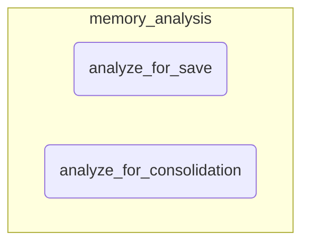

# memory_analysis
The `memory_analysis` module provides LLM-powered functions to intelligently manage memory. It analyzes new content for saving by inferring metadata and plans consolidation actions for existing memories.

<!-- DIAGRAM_JSON
{
    "nodes": [
        {
            "id": "memory_analysis",
            "label": "memory_analysis",
            "type": "module"
        },
        {
            "id": "analyze_for_save",
            "label": "analyze_for_save",
            "type": "function"
        },
        {
            "id": "analyze_for_consolidation",
            "label": "analyze_for_consolidation",
            "type": "function"
        }
    ],
    "edges": [
        {
            "source": "memory_analysis",
            "target": "analyze_for_save",
            "type": "contains"
        },
        {
            "source": "memory_analysis",
            "target": "analyze_for_consolidation",
            "type": "contains"
        }
    ],
    "groups": [
        {
            "id": "memory_analysis_group",
            "label": "memory_analysis",
            "nodes": [
                "analyze_for_save",
                "analyze_for_consolidation"
            ]
        }
    ]
}
-->
