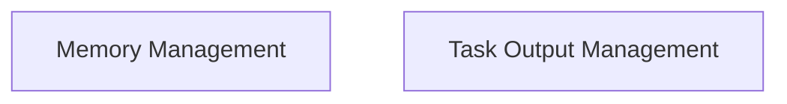

# Memory and Output Utilities

The `memory_and_output_utilities` module provides essential command-line interface (CLI) functionalities for managing the operational memory and logging task outputs within the CrewAI system. It allows users to clear different types of stored data and review the results of previous `crew.kickoff()` executions, ensuring a clean slate for new operations or for debugging purposes.

## Architecture Overview

This module is composed of two primary sub-modules:

1.  **Memory Management**: Responsible for handling the resetting of various memory types.
2.  **Task Output Management**: Focuses on retrieving and displaying the outputs of completed tasks.

<!-- DIAGRAM_JSON
{
    "direction": "TD",
    "nodes": [
        {"id": "memory_management", "label": "Memory Management", "type": "module", "link": "memory_management.md"},
        {"id": "task_output_management", "label": "Task Output Management", "type": "module", "link": "task_output_management.md"}
    ],
    "edges": [],
    "groups": []
}
-->

## Sub-modules

### [Memory Management](memory_management.md)
This sub-module provides utilities for resetting different types of memories used by the CrewAI system. It allows users to clear unified memory, knowledge bases, agent-specific knowledge, and recorded kickoff outputs, facilitating fresh starts for crew operations.

### [Task Output Management](task_output_management.md)
This sub-module focuses on the retrieval and display of outputs generated by `crew.kickoff()` tasks. It provides a convenient way to review the results and status of previously executed tasks directly from the CLI.