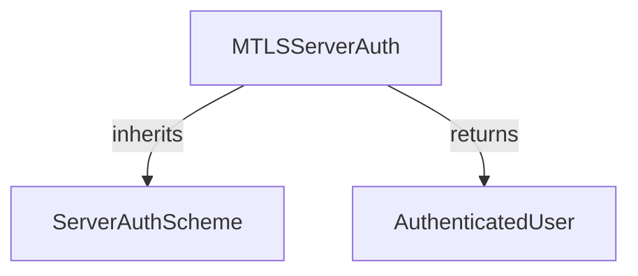

# mtls_server_auth Module Documentation

## Introduction
The `mtls_server_auth` module provides the server-side Mutual TLS (mTLS) authentication scheme for agent-to-agent communication within the CrewAI framework. It acts primarily as a declaration mechanism, signaling to client agents that the server requires client certificates for authentication. The actual mTLS verification is handled at the TLS/transport layer, ensuring secure communication channels.

## Architecture and Component Relationships

### Purpose
This module defines the `MTLSServerAuth` class, which is a specialized `ServerAuthScheme` for handling mTLS. While it exposes an `authenticate` method, its main role is to indicate the mTLS requirement. Upon successful TLS handshake with a client certificate, the `authenticate` method simply confirms the verification.

### Structure
The `mtls_server_auth` module is a leaf module within the `crewai_agent_to_agent_communication.a2a_auth_schemes.server_auth_schemes` package. It directly implements the `ServerAuthScheme` interface and leverages data structures like `AuthenticatedUser` for conveying authentication status.

<!-- DIAGRAM_JSON
{
    "direction": "TD",
    "nodes": [
        {"id": "mtls_server_auth", "label": "MTLSServerAuth", "type": "component", "link": null},
        {"id": "server_auth_scheme", "label": "ServerAuthScheme", "type": "external", "link": "server_auth_schemes.md"},
        {"id": "authenticated_user", "label": "AuthenticatedUser", "type": "external", "link": "a2a_auth_schemes.md"}
    ],
    "edges": [
        {"source": "mtls_server_auth", "target": "server_auth_scheme", "label": "inherits"},
        {"source": "mtls_server_auth", "target": "authenticated_user", "label": "returns"}
    ],
    "groups": []
}
-->


### Components

#### `MTLSServerAuth`
```python
class MTLSServerAuth(ServerAuthScheme):
    """Mutual TLS authentication marker for AgentCard declaration.

    This scheme is primarily for AgentCard security_schemes declaration.
    Actual mTLS verification happens at the TLS/transport layer, not
    at the application layer via token validation.

    When configured, this signals to clients that the server requires
    client certificates for authentication.
    """

    description: str = Field(
        default="Mutual TLS certificate authentication",
        description="Description for the security scheme",
    )

    async def authenticate(self, token: str) -> AuthenticatedUser:
        """Return authenticated user for mTLS.

        mTLS verification happens at the transport layer before this is called.
        If we reach this point, the TLS handshake with client cert succeeded.

        Args:
            token: Certificate subject or identifier (from TLS layer).

        Returns:
            AuthenticatedUser indicating mTLS authentication.
        """
        return AuthenticatedUser(
            token=token or "mtls-verified",
            scheme="mtls",
        )
```

## Integration with the Overall System
The `mtls_server_auth` module is a crucial part of the [server_auth_schemes module](server_auth_schemes.md) within the broader [a2a_auth_schemes module](a2a_auth_schemes.md). It ensures that server-side agent communication can be secured using mTLS, providing a robust authentication mechanism by relying on client certificates verified at the transport layer. This allows agents to establish trusted connections before application-level interactions.
