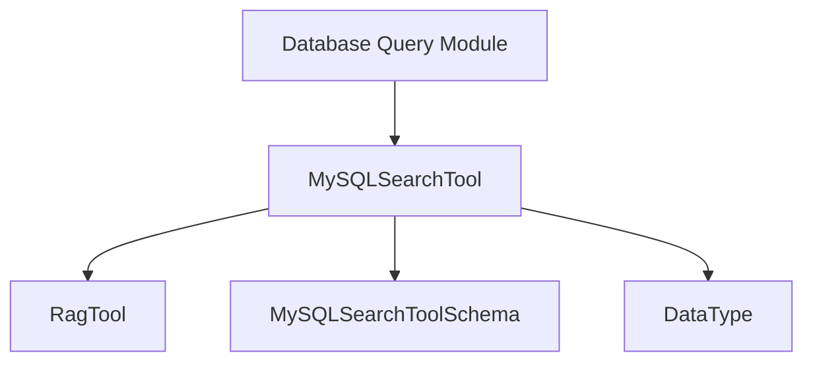

# MySQL Tools Module Documentation

## Introduction
The `mysql_tools` module provides a specialized tool, `MySQLSearchTool`, designed for performing semantic searches within MySQL database tables. This module integrates with the RAG (Retrieval Augmented Generation) system to enable powerful querying capabilities directly against your MySQL data, making it easier for AI agents to interact with and extract information from relational databases.

## Architecture and Component Relationships

<!-- DIAGRAM_JSON
{
    "direction": "TD",
    "nodes": [
        {"id": "mysql_search_tool", "label": "MySQLSearchTool", "type": "component", "link": null},
        {"id": "mysql_search_tool_schema", "label": "MySQLSearchToolSchema", "type": "component", "link": null},
        {"id": "rag_tool", "label": "RagTool", "type": "external", "link": "crewai_tool_base.md"},
        {"id": "data_type", "label": "DataType", "type": "external", "link": "crewai_tool_base.md"},
        {"id": "database_query_module", "label": "Database Query Module", "type": "external", "link": "crewai_tools_database_query.md"}
    ],
    "edges": [
        {"source": "mysql_search_tool", "target": "rag_tool"},
        {"source": "mysql_search_tool", "target": "mysql_search_tool_schema"},
        {"source": "mysql_search_tool", "target": "data_type"},
        {"source": "database_query_module", "target": "mysql_search_tool"}
    ],
    "groups": []
}
-->

The `mysql_tools` module, specifically the `MySQLSearchTool`, is a sub-module of the `crewai_tools_database_query` module. It inherits core functionalities from `RagTool`, which is defined in the `crewai_tool_base` module, providing the foundational capabilities for Retrieval Augmented Generation. The `MySQLSearchTool` defines its argument schema using `MySQLSearchToolSchema` (an internal component) and leverages `DataType` (from `crewai_tool_base`) to specify the data source type during its initialization and data addition processes.

## Core Functionality

The `MySQLSearchTool` is designed to facilitate semantic searches over the content of a specified MySQL database table.

### `MySQLSearchTool` Class

*   **Purpose**: Enables AI agents to perform semantic queries on MySQL database tables.
*   **Inheritance**: Extends `RagTool` from `crewai_tool_base`, inheriting its underlying RAG capabilities.
*   **Attributes**:
    *   `name` (str): Defaults to "Search a database's table content".
    *   `description` (str): Provides a dynamic description based on the `table_name` provided during initialization.
    *   `args_schema` (type[BaseModel]): Uses `MySQLSearchToolSchema` for input validation and structure.
    *   `db_uri` (str): **Mandatory** database URI for connecting to the MySQL instance.
*   **Methods**:
    *   `__init__(self, table_name: str, **kwargs: Any)`:
        *   Initializes the tool with a specific `table_name`.
        *   Calls `super().__init__(**kwargs)` to set up the base `RagTool`.
        *   Adds the specified `table_name` to the RAG system with `DataType.MYSQL` and the provided `db_uri` metadata.
        *   Dynamically updates the tool's `description`.
    *   `add(self, table_name: str, **kwargs: Any) -> None`:
        *   Overrides the base `RagTool.add` method.
        *   Constructs a `SELECT * FROM {table_name};` SQL query and passes it to the `super().add` method, effectively ingesting the entire table content for RAG processing.
    *   `_run(self, search_query: str, similarity_threshold: float | None = None, limit: int | None = None, **kwargs: Any) -> Any`:
        *   Overrides the base `RagTool._run` method.
        *   Executes the semantic search against the pre-indexed MySQL table content.
        *   Accepts `search_query`, `similarity_threshold`, and `limit` to refine the search results.

## How it Fits into the Overall System

The `mysql_tools` module plays a crucial role within the `crewai_tools_database_query` ecosystem by providing specific integration for MySQL databases. It allows `crewai` agents to leverage MySQL data as a knowledge source for generating informed responses. By extending `RagTool`, it seamlessly integrates with the broader RAG capabilities of the `crewai` framework, enabling agents to perform complex data retrieval and analysis tasks without direct SQL interaction.

This module works in conjunction with the `crewai_tool_base` module, which defines the fundamental structure and behavior of all tools within the CrewAI framework, ensuring consistency and interoperability.
