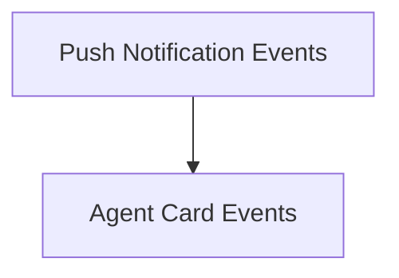

# Notification Events Module

The `notification_events` module defines critical event types used for Agent-to-Agent (A2A) communication within the CrewAI framework. It specifically focuses on events related to the exchange of push notifications and the management of agent card metadata, enabling robust inter-agent communication and operational visibility.

## Architecture Overview

This module is a sub-module of `a2a_events` within the larger [crewai_event_system.md](crewai_event_system.md). It encapsulates the specific event definitions that facilitate asynchronous communication and discovery among agents.

It is composed of the following sub-modules:

- **[Push Notification Events](push_notification_events.md)**: Handles events related to the sending and receiving of push notifications between A2A agents.
- **[Agent Card Events](agent_card_events.md)**: Manages events associated with fetching and utilizing A2A agent cards.

<!-- DIAGRAM_JSON
{
    "direction": "TD",
    "nodes": [
        {"id": "push_notification_events", "label": "Push Notification Events", "type": "module", "link": "push_notification_events.md"},
        {"id": "agent_card_events", "label": "Agent Card Events", "type": "module", "link": "agent_card_events.md"}
    ],
    "edges": [
        {"source": "push_notification_events", "target": "agent_card_events"}
    ],
    "groups": []
}
-->

