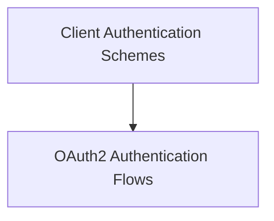

# `oauth2_client_auth` Module Documentation

## Introduction and Purpose

The `oauth2_client_auth` module provides robust and secure implementations of OAuth2 client authentication schemes, specifically for Client Credentials and Authorization Code flows. It enables client applications to authenticate and obtain access tokens for secure communication with protected resources.

This module is a critical part of the `a2a_auth_schemes` within the larger `crewai_agent_to_agent_communication` system, ensuring that agents can securely interact by adhering to standard OAuth2 protocols.

## Architecture Overview

The `oauth2_client_auth` module primarily consists of two core components, each handling a distinct OAuth2 flow. These components are grouped into a single sub-module: `oauth2_flows`.

<!-- DIAGRAM_JSON
{
    "direction": "TD",
    "nodes": [
        {"id": "oauth2_flows", "label": "OAuth2 Authentication Flows", "type": "module", "link": "oauth2_flows.md"},
        {"id": "client_auth_schemes", "label": "Client Authentication Schemes", "type": "module", "link": "client_auth_schemes.md"}
    ],
    "edges": [
        {"source": "client_auth_schemes", "target": "oauth2_flows"}
    ],
    "groups": []
}
-->

## High-level Functionality

- **`oauth2_flows`**: This sub-module encapsulates the logic for both OAuth2 Client Credentials and Authorization Code flows. It handles token fetching, refreshing, and applying authentication headers to HTTP requests. For more details, refer to the [OAuth2 Authentication Flows documentation](oauth2_flows.md).

## How the Module Fits into the Overall System

The `oauth2_client_auth` module is a specialized part of the `a2a_auth_schemes` module, which in turn is a sub-module of `crewai_agent_to_agent_communication`. It provides the necessary client-side OAuth2 capabilities, allowing CrewAI agents to authenticate with external services or other agents that require OAuth2 for secure access. This ensures that inter-agent communication and interactions with external tools are performed with proper authorization, enhancing the overall security and reliability of the CrewAI ecosystem.