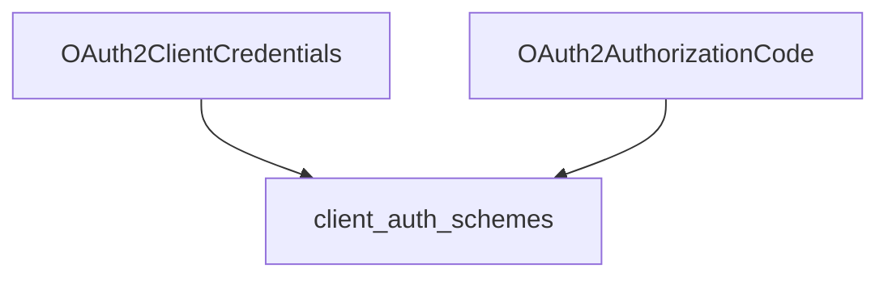

# oauth2_flows Module Documentation

The `oauth2_flows` module is a crucial part of the CrewAI Agent-to-Agent (A2A) communication authentication system, specifically handling OAuth2 client-side authentication flows. It provides implementations for securing agent communication through industry-standard OAuth2 mechanisms.

## Core Functionality

This module implements two primary OAuth2 authentication flows for client applications:

1.  **OAuth2 Client Credentials Flow**: Designed for server-to-server communication where the client application accesses protected resources using its own credentials (client ID and client secret) without direct user involvement.
2.  **OAuth2 Authorization Code Flow**: Intended for applications requiring user consent to access protected resources. It involves a redirect to an authorization server, user authentication, and then an authorization code exchange for an access token.

## Architecture and Component Relationships

The `oauth2_flows` module contains the following key components:

<!-- DIAGRAM_JSON
{
    "direction": "TD",
    "nodes": [
        {"id": "client_credentials", "label": "OAuth2ClientCredentials", "type": "component", "link": null},
        {"id": "authorization_code", "label": "OAuth2AuthorizationCode", "type": "component", "link": null},
        {"id": "client_auth_schemes", "label": "client_auth_schemes", "type": "external", "link": "client_auth_schemes.md"}
    ],
    "edges": [
        {"source": "client_credentials", "target": "client_auth_schemes"},
        {"source": "authorization_code", "target": "client_auth_schemes"}
    ],
    "groups": []
}
-->

### OAuth2ClientCredentials
The `OAuth2ClientCredentials` class provides a thread-safe implementation of the OAuth2 Client Credentials flow. It manages the acquisition and refresh of access tokens using the client's `client_id` and `client_secret`. It uses `asyncio.Lock` to prevent race conditions during token fetching.

**Key Attributes:**
*   `token_url`: The OAuth2 token endpoint URL.
*   `client_id`: The client identifier.
*   `client_secret`: The client secret.
*   `scopes`: A list of required OAuth2 scopes.

**Methods:**
*   `apply_auth(client, headers)`: Applies the access token to the `Authorization` header, fetching a new token if expired or not present.
*   `_fetch_token(client)`: Internal method to fetch a new access token from the `token_url`.

### OAuth2AuthorizationCode
The `OAuth2AuthorizationCode` class implements the OAuth2 Authorization Code flow, also with thread-safe token handling. This flow is suitable for applications that interact with a user for authorization. It requires an interactive authorization callback to obtain the authorization code.

**Key Attributes:**
*   `authorization_url`: The OAuth2 authorization endpoint URL.
*   `token_url`: The OAuth2 token endpoint URL.
*   `client_id`: The client identifier.
*   `client_secret`: The client secret.
*   `redirect_uri`: The URI where the authorization server redirects the user after granting access.
*   `scopes`: A list of required OAuth2 scopes.

**Methods:**
*   `set_authorization_callback(callback)`: Sets an asynchronous callback function responsible for handling the authorization URL and returning the authorization code.
*   `apply_auth(client, headers)`: Applies the access token to the `Authorization` header, handling initial token fetching and refreshing expired tokens.
*   `_fetch_initial_token(client)`: Internal method to initiate the authorization code flow, construct the authorization URL, and obtain the authorization code via the callback.
*   `_refresh_access_token(client)`: Internal method to refresh the access token using a refresh token (if available).

## Integration with the Overall System

The `oauth2_flows` module resides within the [client_auth_schemes](client_auth_schemes.md) submodule, which is part of the broader [a2a_auth_schemes](a2a_auth_schemes.md) module. This structure positions `oauth2_flows` as a specialized provider of OAuth2 authentication mechanisms for client-side agent-to-agent communication within the CrewAI framework.

It ensures that agents can securely authenticate with services using standard OAuth2 flows, contributing to the overall security and interoperability of the CrewAI system. It abstracts the complexities of OAuth2 token management, allowing other components to focus on business logic while relying on this module for robust authentication.
