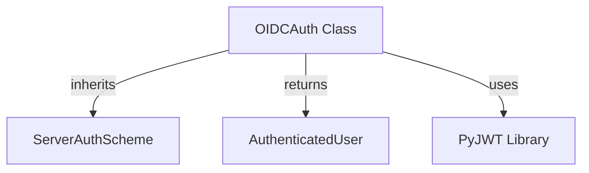

# oidc_auth Module Documentation

## Introduction
The `oidc_auth` module provides robust OpenID Connect (OIDC) authentication capabilities for server-side agent-to-agent communication within the CrewAI framework. It is designed to validate JSON Web Tokens (JWTs) issued by an OIDC provider, ensuring secure and trusted interactions between agents. This module leverages JSON Web Key Sets (JWKS) with caching to efficiently verify token signatures and claims.

## Architecture and Component Relationships

The `oidc_auth` module primarily consists of the `OIDCAuth` class, which extends the `ServerAuthScheme` to implement OIDC-specific authentication logic. It interacts with external libraries like PyJWT for token decoding and signature verification.

<!-- DIAGRAM_JSON
{
    "direction": "TD",
    "nodes": [
        {"id": "oidc_auth_class", "label": "OIDCAuth Class", "type": "component", "link": null},
        {"id": "server_auth_scheme", "label": "ServerAuthScheme", "type": "external", "link": "server_auth_schemes.md"},
        {"id": "authenticated_user", "label": "AuthenticatedUser", "type": "external", "link": "a2a_auth_schemes.md"},
        {"id": "pyjwt_lib", "label": "PyJWT Library", "type": "external", "link": null}
    ],
    "edges": [
        {"source": "oidc_auth_class", "target": "server_auth_scheme", "label": "inherits"},
        {"source": "oidc_auth_class", "target": "authenticated_user", "label": "returns"},
        {"source": "oidc_auth_class", "target": "pyjwt_lib", "label": "uses"}
    ],
    "groups": []
}
-->

## Module Purpose and Core Functionality

The `oidc_auth` module's main purpose is to provide a robust and configurable mechanism for authenticating incoming requests using OpenID Connect JWTs. It ensures that only properly signed and valid tokens from trusted issuers and for the correct audience are accepted.

### `OIDCAuth` Class

The `OIDCAuth` class is the core component of this module, responsible for handling all aspects of OIDC JWT validation.

**Attributes:**

*   **`issuer`** (`HttpUrl`): The OpenID Connect issuer URL (e.g., `https://auth.example.com`). This is the entity that issues the JWTs.
*   **`audience`** (`str`): The expected audience claim in the JWT (e.g., `api://my-agent`). This ensures the token is intended for this specific service.
*   **`jwks_url`** (`HttpUrl | None`): An optional explicit URL for the JSON Web Key Set. If not provided, it is automatically derived from the `issuer` URL (e.g., `https://auth.example.com/.well-known/jwks.json`).
*   **`algorithms`** (`list[str]`): A list of allowed signing algorithms (e.g., `["RS256"]`, `["ES256"]`). Only tokens signed with these algorithms will be considered valid.
*   **`required_claims`** (`list[str]`): A list of claims that must be present in the JWT for it to be considered valid (default: `["exp", "iat", "iss", "aud", "sub"]`).
*   **`jwks_cache_ttl`** (`int`): The Time-To-Live (TTL) in seconds for caching JWKS data. This reduces the need to frequently fetch public keys, improving performance (default: `3600` seconds).
*   **`clock_skew_seconds`** (`float`): The allowed clock skew in seconds for token validation. This accounts for minor time differences between the token issuer and the validating server (default: `30.0` seconds).

**Methods:**

*   **`_init_jwk_client(self) -> Self`**:
    *   **Purpose**: Initializes the `PyJWKClient` after the `OIDCAuth` instance is created. This method dynamically determines the JWKS URL if not explicitly provided and sets up the client with the specified cache TTL.
    *   **Internal Mechanism**: It uses the `issuer` to construct the default JWKS URL if `jwks_url` is `None`.

*   **`authenticate(self, token: str) -> AuthenticatedUser`**:
    *   **Purpose**: Authenticates a given JWT token against the configured OIDC parameters. It decodes the token, verifies its signature using the JWKS, and validates its claims (audience, issuer, expiration, required claims).
    *   **Parameters**:
        *   `token` (`str`): The JWT string to be authenticated.
    *   **Returns**:
        *   `AuthenticatedUser`: An object containing the token, scheme ("oidc"), and decoded claims if authentication is successful.
    *   **Raises**:
        *   `HTTPException`: Throws an `HTTPException` with appropriate status codes (e.g., `401 Unauthorized`, `500 Internal Server Error`, `503 Service Unavailable`) and detailed messages for various authentication failures, including:
            *   Expired token (`jwt.ExpiredSignatureError`)
            *   Invalid audience (`jwt.InvalidAudienceError`)
            *   Invalid issuer (`jwt.InvalidIssuerError`)
            *   Missing required claims (`jwt.MissingRequiredClaimError`)
            *   JWKS client errors (e.g., unable to fetch signing keys) (`jwt.PyJWKClientError`)
            *   General invalid token errors (`jwt.InvalidTokenError`)

## How the Module Fits into the Overall System

The `oidc_auth` module is a crucial part of the `crewai_agent_to_agent_communication` system, specifically within the `a2a_auth_schemes.server_auth_schemes` submodule. It provides one of the supported server-side authentication mechanisms, allowing agents to securely receive and process requests authenticated via OpenID Connect.

It enables CrewAI agents to act as resource servers, validating JWTs presented by other agents or external services that have been authenticated by an OIDC Identity Provider. This modular design allows for flexible authentication strategies, where `OIDCAuth` can be enabled alongside or in place of other [server authentication schemes](server_auth_schemes.md) as required by the deployment environment.

By integrating with the base [ServerAuthScheme](server_auth_schemes.md), `OIDCAuth` ensures consistency in how server-side authentication is handled across the CrewAI framework, contributing to a secure and interoperable agent ecosystem.
