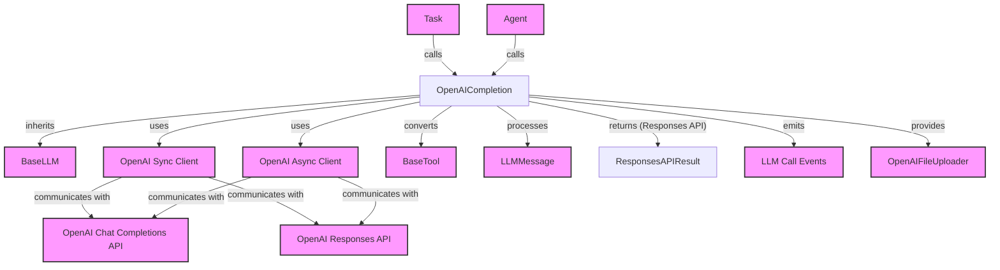

# openai_completion Module Documentation

## Introduction
The `openai_completion` module provides the `OpenAICompletion` class, a robust and flexible implementation for integrating with OpenAI's large language models. It supports both the traditional Chat Completions API and the newer Responses API, offering comprehensive features for building AI-powered applications within the CrewAI framework. This module is essential for agents that leverage OpenAI models for generating text, executing tools, and managing conversational state.

## Core Functionality
The `OpenAICompletion` class encapsulates the logic for:
*   **OpenAI API Integration:** Direct integration with the OpenAI Python SDK, allowing communication with both Chat Completions and Responses APIs.
*   **Flexible Configuration:** Supports various OpenAI client parameters such as API key, organization, project, timeout, and retry mechanisms.
*   **Synchronous and Asynchronous Operations:** Provides both `call` and `acall` methods for executing API requests synchronously and asynchronously, respectively.
*   **Streaming Support:** Handles streaming responses for both Chat Completions and Responses APIs, enabling real-time output processing.
*   **Built-in Tool Integration (Responses API):** Facilitates the use of OpenAI's built-in tools like web search, file search, code interpreter, and computer use.
*   **Auto-Chaining:** Automatically tracks and utilizes response IDs for multi-turn conversations, improving conversational flow with the Responses API.
*   **Zero Data Retention (ZDR) Reasoning:** Supports automatic tracking and passing of encrypted reasoning items to maintain chain-of-thought for ZDR compliance when using the Responses API.
*   **Structured Output:** Enables structured output generation and validation using Pydantic models for both API types.
*   **Token Usage Tracking:** Extracts and tracks token usage from OpenAI API responses.
*   **Context Window Management:** Provides methods to determine the context window size for various OpenAI models.
*   **Multimodal Input Support:** Detects if the configured model supports multimodal inputs (e.g., GPT-4o, GPT-4.1, GPT-5, o-series).
*   **Tool Conversion:** Converts CrewAI tool definitions into the appropriate format for OpenAI's function calling.
*   **File Uploader Integration:** Provides an instance of `OpenAIFileUploader` for seamless file management with OpenAI services.

## Architecture and Component Relationships

The `OpenAICompletion` class is the central component of this module. It extends the `BaseLLM` class, ensuring it adheres to the standardized LLM interface within CrewAI. It leverages the OpenAI Python SDK's `OpenAI` and `AsyncOpenAI` clients to interact with the external OpenAI Chat Completions and Responses APIs.

For tool usage, `OpenAICompletion` is responsible for converting `BaseTool` objects (defined in the [crewai_tool_base](crewai_tool_base.md) module) into the OpenAI-specific function calling format. It also interacts with `Task` (from [crewai_task_management](crewai_task_management.md)) and `Agent` (from [crewai_agent_core](crewai_agent_core.md)) contexts, and emits various events through the CrewAI event system (detailed in [crewai_event_system](crewai_event_system.md)). When utilizing the Responses API with `parse_tool_outputs` enabled, it returns structured `ResponsesAPIResult` objects, which include parsed outputs from built-in tools. Additionally, it can provide an `OpenAIFileUploader` instance (from [crewai_files_uploaders](crewai_files_uploaders.md)) for handling file uploads.

<!-- DIAGRAM_JSON
{
    "direction": "TD",
    "nodes": [
        {"id": "OpenAICompletion", "label": "OpenAICompletion", "type": "component", "link": null},
        {"id": "BaseLLM", "label": "BaseLLM", "type": "external", "link": "llm_base.md"},
        {"id": "OpenAI_Client", "label": "OpenAI Sync Client", "type": "external", "link": null},
        {"id": "AsyncOpenAI_Client", "label": "OpenAI Async Client", "type": "external", "link": null},
        {"id": "OpenAI_ChatCompletions_API", "label": "OpenAI Chat Completions API", "type": "external", "link": null},
        {"id": "OpenAI_Responses_API", "label": "OpenAI Responses API", "type": "external", "link": null},
        {"id": "BaseTool", "label": "BaseTool", "type": "external", "link": "crewai_tool_base.md"},
        {"id": "LLMMessage", "label": "LLMMessage", "type": "external", "link": null},
        {"id": "Task", "label": "Task", "type": "external", "link": "crewai_task_management.md"},
        {"id": "Agent", "label": "Agent", "type": "external", "link": "crewai_agent_core.md"},
        {"id": "ResponsesAPIResult", "label": "ResponsesAPIResult", "type": "component", "link": null},
        {"id": "LLMCallEvents", "label": "LLM Call Events", "type": "external", "link": "crewai_event_system.md"},
        {"id": "OpenAIFileUploader", "label": "OpenAIFileUploader", "type": "external", "link": "crewai_files_uploaders.md"}
    ],
    "edges": [
        {"source": "OpenAICompletion", "target": "BaseLLM", "label": "inherits"},
        {"source": "OpenAICompletion", "target": "OpenAI_Client", "label": "uses"},
        {"source": "OpenAICompletion", "target": "AsyncOpenAI_Client", "label": "uses"},
        {"source": "OpenAI_Client", "target": "OpenAI_ChatCompletions_API", "label": "communicates with"},
        {"source": "AsyncOpenAI_Client", "target": "OpenAI_ChatCompletions_API", "label": "communicates with"},
        {"source": "OpenAI_Client", "target": "OpenAI_Responses_API", "label": "communicates with"},
        {"source": "AsyncOpenAI_Client", "target": "OpenAI_Responses_API", "label": "communicates with"},
        {"source": "OpenAICompletion", "target": "BaseTool", "label": "converts"},
        {"source": "OpenAICompletion", "target": "LLMMessage", "label": "processes"},
        {"source": "Task", "target": "OpenAICompletion", "label": "calls"},
        {"source": "Agent", "target": "OpenAICompletion", "label": "calls"},
        {"source": "OpenAICompletion", "target": "ResponsesAPIResult", "label": "returns (Responses API)"},
        {"source": "OpenAICompletion", "target": "LLMCallEvents", "label": "emits"},
        {"source": "OpenAICompletion", "target": "OpenAIFileUploader", "label": "provides"}
    ],
    "groups": []
}
-->

## How it Fits into the Overall System
The `openai_completion` module is a vital component within the `crewai_llm_integrations` package, providing the specific implementation for OpenAI's powerful language models. It serves as the bridge between the CrewAI framework's agents and tasks and the OpenAI API.

When a CrewAI agent is configured to use an OpenAI model, the `OpenAICompletion` instance is utilized to handle all LLM interactions. This includes generating responses to prompts, executing tools defined by the agent, and managing conversational state. Its ability to support both OpenAI API versions allows the CrewAI framework to adapt to evolving OpenAI features and capabilities.

The module's integration with the [crewai_tool_base](crewai_tool_base.md) ensures that any tools defined within CrewAI can be seamlessly translated and executed by OpenAI models. Furthermore, its event emission capabilities, supported by the [crewai_event_system](crewai_event_system.md), enable comprehensive logging and observability of LLM interactions. The file uploader integration (via [crewai_files_uploaders](crewai_files_uploaders.md)) facilitates advanced agent behaviors involving file processing.

By abstracting the complexities of the OpenAI API, `openai_completion` allows developers to easily incorporate OpenAI's cutting-edge models into their CrewAI applications, benefiting from features like advanced tool use, structured outputs, and efficient token management.
