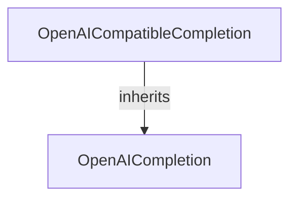

# openai_family_integrations
This module provides classes for integrating with OpenAI's native completion APIs and a compatible interface for various OpenAI-like providers.

<!-- DIAGRAM_JSON
{
  "nodes": [
    {
      "id": "OpenAICompletion",
      "label": "OpenAICompletion",
      "type": "class",
      "description": "OpenAI native completion implementation, integrating directly with the OpenAI Python SDK for Chat Completions and Responses APIs."
    },
    {
      "id": "OpenAICompatibleCompletion",
      "label": "OpenAICompatibleCompletion",
      "type": "class",
      "description": "OpenAI-compatible completion implementation, supporting various providers by auto-configuring base URL, API key, and headers."
    }
  ],
  "edges": [
    {
      "source": "OpenAICompatibleCompletion",
      "target": "OpenAICompletion",
      "type": "inherits"
    }
  ],
  "groups": []
}
-->
