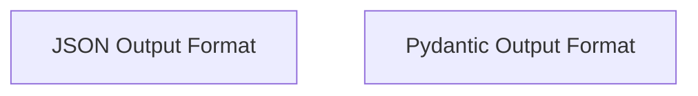

# Output Annotations Module Documentation

## Introduction and Purpose
The `output_annotations` module in CrewAI provides decorators that allow developers to specify the desired output format for their classes. This ensures that the output generated by these classes adheres to a predefined structure, such as JSON or Pydantic models, facilitating structured data handling and validation within the CrewAI framework.

## Architecture Overview
This module is part of the `crewai_project_structure` and specifically a sub-module of `project_annotations`. It focuses on defining and enforcing output formats for classes through simple annotations, contributing to predictable and manageable data flows.

<!-- DIAGRAM_JSON
{
    "direction": "TD",
    "nodes": [
        {"id": "json_output_format", "label": "JSON Output Format", "type": "module", "link": "json_output_format.md"},
        {"id": "pydantic_output_format", "label": "Pydantic Output Format", "type": "module", "link": "pydantic_output_format.md"}
    ],
    "edges": [],
    "groups": []
}
-->

## Sub-modules

### [JSON Output Format](json_output_format.md)
This sub-module provides the `output_json` decorator, which marks a class to indicate that its output should be serialized into JSON format. This is crucial for consistent data interchange and integration with systems expecting JSON.

### [Pydantic Output Format](pydantic_output_format.md)
This sub-module offers the `output_pydantic` decorator, used to mark a class whose output is expected to conform to a specified Pydantic model. This enables robust data validation, serialization, and deserialization, leveraging Pydantic's capabilities for data integrity.
