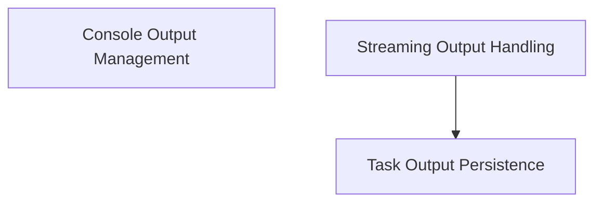

# Output Handling Module

The `output_handling` module is responsible for managing various aspects of output generation, display, streaming, and persistence within the system. It centralizes functionalities related to how information is presented to the user, how real-time data streams are processed, and how task execution results are stored and retrieved.

## Architecture Overview

The module is structured into three main sub-modules, each handling a specific facet of output management:

- **Console Output Management**: Focuses on formatted and colored console output.
- **Streaming Output Handling**: Deals with processing and enqueuing real-time stream chunks, particularly from LLMs.
- **Task Output Persistence**: Manages the storage and retrieval of task execution logs and results.

These sub-modules interact to provide a comprehensive output management system, ensuring that all forms of output are handled efficiently and consistently.

<!-- DIAGRAM_JSON
{
    "direction": "TD",
    "nodes": [
        {"id": "console_output_management", "label": "Console Output Management", "type": "module", "link": "console_output_management.md"},
        {"id": "streaming_output_handling", "label": "Streaming Output Handling", "type": "module", "link": "streaming_output_handling.md"},
        {"id": "task_output_persistence", "label": "Task Output Persistence", "type": "module", "link": "task_output_persistence.md"}
    ],
    "edges": [
        {"source": "streaming_output_handling", "target": "task_output_persistence"}
    ],
    "groups": []
}
-->

## Sub-modules

### [Console Output Management](console_output_management.md)
This sub-module handles colored console output formatting, ensuring a clear and organized presentation of information to the user.

### [Streaming Output Handling](streaming_output_handling.md)
This sub-module is responsible for processing and managing real-time stream chunks, particularly from Language Model (LLM) events, enqueuing them for further processing.

### [Task Output Persistence](task_output_persistence.md)
This sub-module provides functionalities for storing, updating, and retrieving task execution outputs, facilitating features like replay and audit trails.