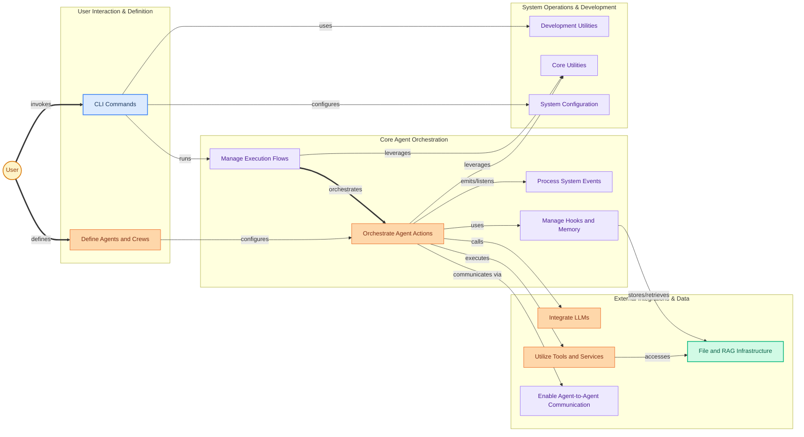

The `crewai` repository is the foundational framework for developing and deploying multi-agent AI systems. It enables the creation of intelligent agents that collaborate to solve complex problems, automating workflows by leveraging a rich ecosystem of tools, diverse data sources, and various Large Language Models (LLMs).

At its core, `crewai` provides robust mechanisms for defining agent roles, orchestrating their interactions, and managing the flow of tasks within a "crew." It simplifies the integration of external capabilities, allowing agents to perform actions like web scraping, data analysis, and interacting with other AI services. The framework also includes comprehensive data and knowledge management features, facilitating Retrieval Augmented Generation (RAG) to ensure agents have access to relevant, up-to-date information. Furthermore, `crewai` offers a powerful command-line interface and development utilities for seamless project setup, execution, monitoring, and debugging of agentic workflows.

<!-- DIAGRAM_JSON
{
    "direction": "LR",
    "nodes": [
        {
            "id": "a2a_comm",
            "label": "Enable Agent-to-Agent Communication",
            "type": "module",
            "link": "a2a_communication.md"
        },
        {
            "id": "cli_commands",
            "label": "CLI Commands",
            "type": "module",
            "link": "cli_commands.md"
        },
        {
            "id": "core_utils",
            "label": "Core Utilities",
            "type": "module",
            "link": "core_utilities.md"
        },
        {
            "id": "define_crew",
            "label": "Define Agents and Crews",
            "type": "module",
            "link": "project_structure.md"
        },
        {
            "id": "dev_utils",
            "label": "Development Utilities",
            "type": "module",
            "link": "development_tools.md"
        },
        {
            "id": "file_rag_infra",
            "label": "File and RAG Infrastructure",
            "type": "module",
            "link": "file_and_rag_infra.md"
        },
        {
            "id": "handle_events",
            "label": "Process System Events",
            "type": "module",
            "link": "event_system.md"
        },
        {
            "id": "hooks_memory",
            "label": "Manage Hooks and Memory",
            "type": "module",
            "link": "hooks_and_memory.md"
        },
        {
            "id": "integrate_llms",
            "label": "Integrate LLMs",
            "type": "module",
            "link": "llm_integrations.md"
        },
        {
            "id": "manage_flows",
            "label": "Manage Execution Flows",
            "type": "module",
            "link": "flow_management.md"
        },
        {
            "id": "orchestrate_agents",
            "label": "Orchestrate Agent Actions",
            "type": "module",
            "link": "agent_orchestration.md"
        },
        {
            "id": "system_config",
            "label": "System Configuration",
            "type": "module",
            "link": "system_config.md"
        },
        {
            "id": "use_tools",
            "label": "Utilize Tools and Services",
            "type": "module",
            "link": "tools_and_integrations.md"
        },
        {
            "id": "user",
            "label": "User",
            "type": "component"
        }
    ],
    "edges": [
        {
            "source": "user",
            "target": "cli_commands",
            "label": "invokes"
        },
        {
            "source": "user",
            "target": "define_crew",
            "label": "defines"
        },
        {
            "source": "cli_commands",
            "target": "manage_flows",
            "label": "runs"
        },
        {
            "source": "define_crew",
            "target": "orchestrate_agents",
            "label": "configures"
        },
        {
            "source": "manage_flows",
            "target": "orchestrate_agents",
            "label": "orchestrates"
        },
        {
            "source": "orchestrate_agents",
            "target": "handle_events",
            "label": "emits/listens"
        },
        {
            "source": "orchestrate_agents",
            "target": "hooks_memory",
            "label": "uses"
        },
        {
            "source": "orchestrate_agents",
            "target": "integrate_llms",
            "label": "calls"
        },
        {
            "source": "orchestrate_agents",
            "target": "use_tools",
            "label": "executes"
        },
        {
            "source": "orchestrate_agents",
            "target": "a2a_comm",
            "label": "communicates via"
        },
        {
            "source": "use_tools",
            "target": "file_rag_infra",
            "label": "accesses"
        },
        {
            "source": "hooks_memory",
            "target": "file_rag_infra",
            "label": "stores/retrieves"
        },
        {
            "source": "cli_commands",
            "target": "dev_utils",
            "label": "uses"
        },
        {
            "source": "cli_commands",
            "target": "system_config",
            "label": "configures"
        },
        {
            "source": "orchestrate_agents",
            "target": "core_utils",
            "label": "leverages"
        },
        {
            "source": "manage_flows",
            "target": "core_utils",
            "label": "leverages"
        }
    ],
    "groups": [
        {
            "id": "user_interaction",
            "label": "User Interaction & Definition",
            "nodes": [
                "cli_commands",
                "define_crew"
            ]
        },
        {
            "id": "core_orchestration",
            "label": "Core Agent Orchestration",
            "nodes": [
                "orchestrate_agents",
                "manage_flows",
                "handle_events",
                "hooks_memory"
            ]
        },
        {
            "id": "external_integrations",
            "label": "External Integrations & Data",
            "nodes": [
                "integrate_llms",
                "use_tools",
                "a2a_comm",
                "file_rag_infra"
            ]
        },
        {
            "id": "system_ops",
            "label": "System Operations & Development",
            "nodes": [
                "dev_utils",
                "core_utils",
                "system_config"
            ]
        }
    ],
    "_auto_generated": "r1_overview_synthesis"
}
-->

