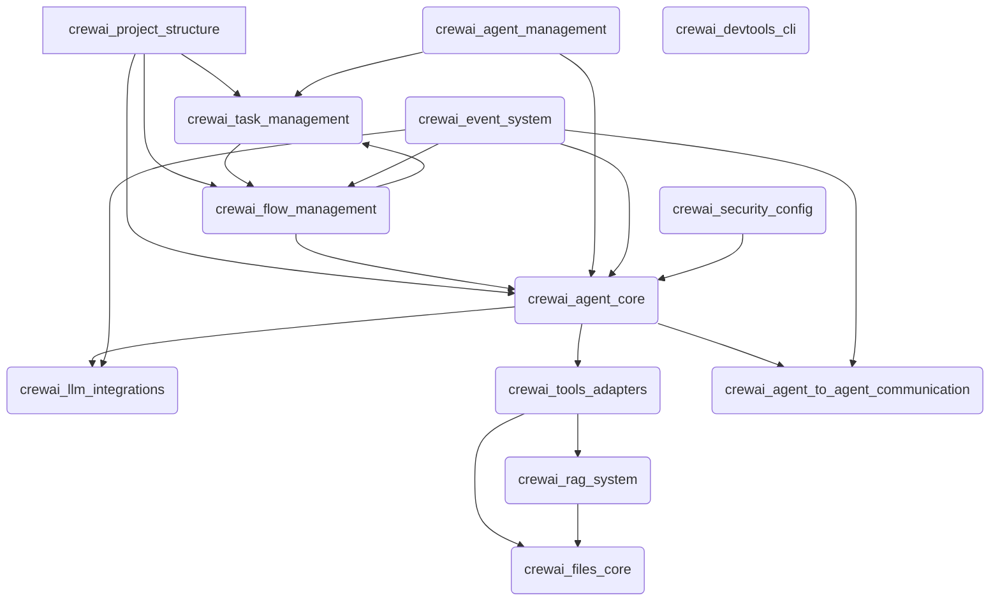

The `crewai-src` repository serves as the foundational framework for building, orchestrating, and managing autonomous AI agents and multi-agent systems. It provides a comprehensive ecosystem for defining project structures, agent behaviors, task execution, and complex workflows (flows). The repository integrates various Large Language Models (LLMs) and offers an extensive suite of tools for diverse operations, including web interaction, data manipulation, database querying, and AI model utilization.

Key capabilities include:
- **Agent and Crew Orchestration**: Core components for defining agents, managing their execution, and structuring collaborative crews.
- **LLM Integrations**: Seamless connectivity with various LLM providers for generative AI capabilities.
- **Tooling**: A rich collection of tools and adapters for web search, web scraping, data file operations, database queries, vector database interactions, and AI model-specific functionalities.
- **Knowledge Management**: Retrieval Augmented Generation (RAG) system for integrating external knowledge sources and efficient file handling.
- **Inter-Agent Communication**: Mechanisms for secure and robust Agent-to-Agent (A2A) communication, enabling complex multi-agent collaborations.
- **Workflow Management**: Tools for defining and managing dynamic flows, tasks, and event-driven processes.
- **System Infrastructure**: Core utilities for event handling, execution context management, security configuration, and development tools.

### Architecture Diagram

