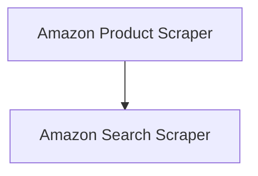

# Oxylabs Amazon Scrapers Module

## Introduction and Purpose
The `oxylabs_amazon_scrapers` module provides a set of tools designed to facilitate scraping data from Amazon using Oxylabs APIs. This includes specialized tools for extracting information from individual product pages and for gathering results from Amazon search queries. It streamlines the process of integrating Oxylabs scraping capabilities into broader automation workflows.

## Architecture Overview
The module is structured into two primary sub-modules, each dedicated to a specific scraping function on Amazon. Both sub-modules leverage the Oxylabs API for their operations, ensuring efficient and reliable data retrieval.

<!-- DIAGRAM_JSON
{
    "direction": "TD",
    "nodes": [
        {"id": "amazon_product_scraper", "label": "Amazon Product Scraper", "type": "module", "link": "amazon_product_scraper.md"},
        {"id": "amazon_search_scraper", "label": "Amazon Search Scraper", "type": "module", "link": "amazon_search_scraper.md"}
    ],
    "edges": [
        {"source": "amazon_product_scraper", "target": "amazon_search_scraper"}
    ],
    "groups": []
}
-->

## Sub-modules

### [Amazon Product Scraper](amazon_product_scraper.md)
This sub-module focuses on scraping data from specific Amazon product pages. It provides tools to extract detailed product information, such as descriptions, prices, reviews, and more.

### [Amazon Search Scraper](amazon_search_scraper.md)
This sub-module is designed for scraping results from Amazon search queries. It enables users to retrieve lists of products based on search terms, along with relevant metadata from the search results page.