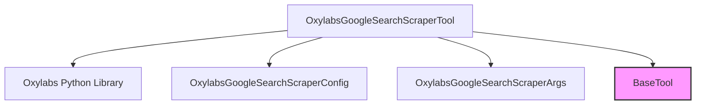

# oxylabs_integration

This module provides an integration with the Oxylabs API for performing Google searches within the CrewAI framework. It encapsulates the logic for authenticating with Oxylabs, making search requests, and processing the results.

## Core Functionality

The `oxylabs_integration` module's primary function is to enable agents to scrape Google Search results using the Oxylabs Realtime API. This is achieved through the `OxylabsGoogleSearchScraperTool` component, which handles the entire lifecycle of a search request:

-   **Credential Management**: Securely retrieves Oxylabs API credentials from environment variables (`OXYLABS_USERNAME`, `OXYLABS_PASSWORD`) or accepts them directly during tool instantiation.
-   **Dependency Handling**: Automatically prompts for and installs the `oxylabs` Python package if it's not found, ensuring a smooth setup process for developers.
-   **Search Execution**: Formulates and dispatches search queries to the Oxylabs Google Search Scraper endpoint.
-   **Response Processing**: Parses the API response and extracts relevant content, returning it in a usable format (JSON for dictionaries, string otherwise).
-   **Configuration**: Allows for flexible configuration of search parameters through the `OxylabsGoogleSearchScraperConfig` model.

## Architecture and Component Relationships

The `oxylabs_integration` module is centered around the `OxylabsGoogleSearchScraperTool`, which acts as the interface for interacting with the Oxylabs API. It inherits from `BaseTool`, a foundational class for all tools in the CrewAI ecosystem, ensuring consistency and adherence to the framework's tool standards.

<!-- DIAGRAM_JSON
{
    "direction": "TD",
    "nodes": [
        {"id": "oxylabs_google_search_scraper_tool", "label": "OxylabsGoogleSearchScraperTool", "type": "component", "link": null},
        {"id": "oxylabs_config_model", "label": "OxylabsGoogleSearchScraperConfig", "type": "component", "link": null},
        {"id": "oxylabs_args_model", "label": "OxylabsGoogleSearchScraperArgs", "type": "component", "link": null},
        {"id": "oxylabs_library", "label": "Oxylabs Python Library", "type": "external", "link": null},
        {"id": "crewai_tool_base", "label": "BaseTool", "type": "external", "link": "crewai_tool_base.md"}
    ],
    "edges": [
        {"source": "oxylabs_google_search_scraper_tool", "target": "oxylabs_library"},
        {"source": "oxylabs_google_search_scraper_tool", "target": "oxylabs_config_model"},
        {"source": "oxylabs_google_search_scraper_tool", "target": "oxylabs_args_model"},
        {"source": "oxylabs_google_search_scraper_tool", "target": "crewai_tool_base"}
    ],
    "groups": []
}
-->

### Component Details

#### `OxylabsGoogleSearchScraperTool`

-   **Purpose**: This is the core class that provides the functionality to scrape Google search results using the Oxylabs Realtime API. It acts as a callable tool for CrewAI agents.
-   **Key Features**:
    -   **Initialization**: Handles the setup of the Oxylabs `RealtimeClient`, including authentication using provided credentials or environment variables. It also manages the installation of the `oxylabs` package if it's not present.
    -   **Configuration (`config`)**: Utilizes an `OxylabsGoogleSearchScraperConfig` object to customize search parameters.
    -   **Arguments (`args_schema`)**: Defines the input arguments for the tool, typically a `query` string, using `OxylabsGoogleSearchScraperArgs`.
    -   **Execution (`_run`)**: Executes the Google search query through the `oxylabs_api` client and processes the raw response into a usable string or JSON format.
-   **Relationships**:
    -   Inherits from [BaseTool](crewai_tool_base.md), gaining standard tool properties and methods.
    -   Depends on the external `oxylabs` Python library for API communication.
    -   Depends on `OxylabsGoogleSearchScraperConfig` for search configuration.
    -   Depends on `OxylabsGoogleSearchScraperArgs` for defining tool input arguments.

## How the Module Fits into the Overall System

The `oxylabs_integration` module is a vital part of the `crewai_tools_web_search` package. It extends the web search capabilities of CrewAI agents by providing a robust and reliable mechanism to gather information directly from Google Search results through Oxylabs.

This integration allows agents to:
-   Perform targeted information retrieval for tasks requiring up-to-date web data.
-   Automate data collection from search engines without directly managing proxies or CAPTCHAs, as these are handled by the Oxylabs service.
-   Enhance the intelligence and decision-making processes of agents by feeding them rich, scraped web content.

By abstracting the complexities of the Oxylabs API, this module provides a simple, plug-and-play solution for CrewAI users who require advanced web scraping functionalities within their agent workflows. It aligns with the CrewAI philosophy of offering a diverse set of tools to empower agents with various capabilities.
