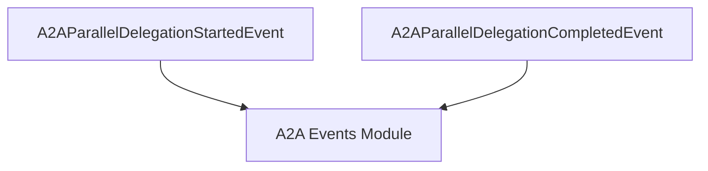

# `parallel_delegation_events` Module Documentation

The `parallel_delegation_events` module is a crucial part of the CrewAI event system, specifically designed to handle the lifecycle events of parallel delegation between Agent-to-Agent (A2A) communications. It defines the specific events that are emitted when a parallel delegation process begins and completes, providing transparency and traceability for multi-agent interactions.

This module ensures that the system can accurately track the progress and outcomes of tasks delegated simultaneously to multiple agents, which is vital for complex workflows requiring concurrent agent collaboration.

### Module Architecture

The `parallel_delegation_events` module is a leaf module within the `crewai_event_system`, nested under `a2a_events` and `delegation_events`. Its primary function is to define the event structures for parallel delegation, inheriting base functionalities from the broader `a2a_events` module.

<!-- DIAGRAM_JSON
{
    "direction": "TD",
    "nodes": [
        {"id": "parallel_delegation_started", "label": "A2AParallelDelegationStartedEvent", "type": "component", "link": null},
        {"id": "parallel_delegation_completed", "label": "A2AParallelDelegationCompletedEvent", "type": "component", "link": null},
        {"id": "a2a_events", "label": "A2A Events Module", "type": "external", "link": "a2a_events.md"}
    ],
    "edges": [
        {"source": "parallel_delegation_started", "target": "a2a_events"},
        {"source": "parallel_delegation_completed", "target": "a2a_events"}
    ],
    "groups": []
}
-->


### Core Components

The module comprises two main event classes, both inheriting from `A2AEventBase` (defined in the [a2a_events module](a2a_events.md)), which provides a common structure for all A2A-related events.

1.  **`A2AParallelDelegationStartedEvent`**
    *   **Purpose**: This event is emitted at the very beginning of a parallel delegation process. It signifies that a task has been distributed to multiple A2A agents for concurrent execution.
    *   **Attributes**: 
        *   `type`: A string identifier, fixed as `"a2a_parallel_delegation_started"`.
        *   `endpoints`: A list of strings, each representing the endpoint of an A2A agent to which the task has been delegated.
        *   `task_description`: A string detailing the task that is being delegated to the agents.

    ```python
    class A2AParallelDelegationStartedEvent(A2AEventBase):
        """Event emitted when parallel delegation to multiple A2A agents begins.

        Attributes:
            endpoints: List of A2A agent endpoints being delegated to.
            task_description: Description of the task being delegated.
        """

        type: str = "a2a_parallel_delegation_started"
        endpoints: list[str]
        task_description: str
    ```

2.  **`A2AParallelDelegationCompletedEvent`**
    *   **Purpose**: This event is emitted once all A2A agents involved in a parallel delegation have completed their assigned tasks, regardless of success or failure. It provides a summary of the delegation's outcome.
    *   **Attributes**: 
        *   `type`: A string identifier, fixed as `"a2a_parallel_delegation_completed"`.
        *   `endpoints`: A list of strings, similar to the `StartedEvent`, indicating the endpoints of the agents that were part of this delegation.
        *   `success_count`: An integer representing the number of agents that successfully completed their delegated tasks.
        *   `failure_count`: An integer representing the number of agents that failed to complete their delegated tasks.
        *   `results`: An optional dictionary where keys are agent identifiers (e.g., endpoints) and values are string summaries of the results from each agent. This provides detailed feedback on individual agent performance.

    ```python
    class A2AParallelDelegationCompletedEvent(A2AEventBase):
        """Event emitted when parallel delegation to multiple A2A agents completes.

        Attributes:
            endpoints: List of A2A agent endpoints that were delegated to.
            success_count: Number of successful delegations.
            failure_count: Number of failed delegations.
            results: Summary of results from each agent.
        """

        type: str = "a2a_parallel_delegation_completed"
        endpoints: list[str]
        success_count: int
        failure_count: int
        results: dict[str, str] | None = None
    ```

### Relationship to the Overall System

The `parallel_delegation_events` module plays a vital role within the larger [crewai_event_system](crewai_event_system.md), specifically contributing to the [a2a_events module](a2a_events.md) which governs all Agent-to-Agent communication events. By defining distinct events for the start and completion of parallel delegations, this module enables:

*   **Monitoring and Observability**: System components and external tools can subscribe to these events to monitor the real-time progress of parallel tasks and identify bottlenecks or failures.
*   **Workflow Orchestration**: Higher-level orchestration logic can use these events to trigger subsequent actions, manage retries, or compile aggregate results from multiple agents.
*   **Debugging and Auditing**: The detailed information contained within these events aids in debugging complex multi-agent interactions and provides an auditable trail of task delegations.

This module ensures that parallel execution, a common pattern in multi-agent systems, is a first-class citizen in the eventing mechanism, providing the necessary hooks for robust and scalable agentic workflows.
