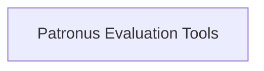

# Patronus API Evaluator Module

The `patronus_api_evaluator` module is responsible for integrating with the Patronus AI platform to perform evaluations of agent interactions and outputs. It provides tools that allow for both flexible and predefined criteria-based evaluations, with results logged directly to the Patronus platform.

## Architecture

The `patronus_api_evaluator` module is composed of the `patronus_evaluation_tools` sub-module, which encapsulates the core logic for interacting with the Patronus evaluation API.

<!-- DIAGRAM_JSON
{
    "direction": "TD",
    "nodes": [
        {"id": "patronus_evaluation_tools", "label": "Patronus Evaluation Tools", "type": "module", "link": "patronus_evaluation_tools.md"}
    ],
    "edges": [],
    "groups": []
}
-->

## Sub-modules

### [Patronus Evaluation Tools](patronus_evaluation_tools.md)
This sub-module provides the core functionality for interacting with the Patronus AI evaluation platform. It includes tools for evaluating agent inputs and outputs against dynamic or predefined criteria, facilitating automated assessment and performance tracking.