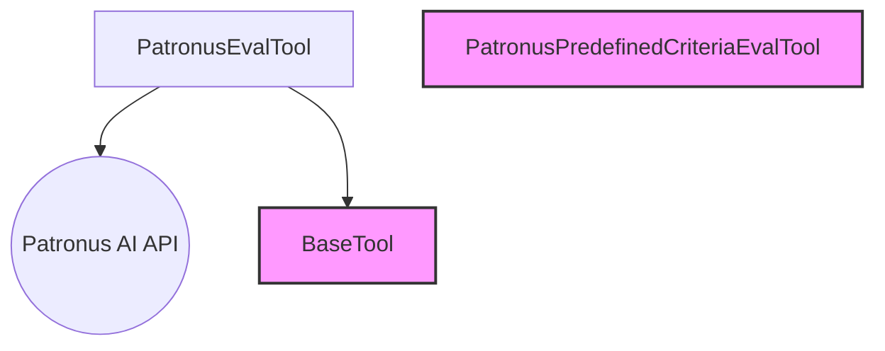

# patronus_dynamic_evaluator_tool

The `patronus_dynamic_evaluator_tool` module provides the `PatronusEvalTool`, a powerful component for integrating dynamic evaluation capabilities from Patronus AI into CrewAI agents. This tool allows agents to assess the quality of their generated outputs, inputs, and retrieved contexts by dynamically selecting appropriate evaluators and criteria from the Patronus AI platform.

## Architecture and Component Relationships

The `PatronusEvalTool` is the primary component within this module. It leverages the Patronus AI API to fetch available evaluators and criteria, enabling a flexible and dynamic evaluation process.

<!-- DIAGRAM_JSON
{
    "direction": "TD",
    "nodes": [
        {"id": "patronus_eval_tool", "label": "PatronusEvalTool", "type": "component", "link": null},
        {"id": "patronus_ai_api", "label": "Patronus AI API", "type": "external", "link": null},
        {"id": "base_tool", "label": "BaseTool", "type": "external", "link": "crewai_tool_base.md"},
        {"id": "patronus_predefined_criteria_eval_tool", "label": "PatronusPredefinedCriteriaEvalTool", "type": "external", "link": "patronus_predefined_evaluator_tool.md"}
    ],
    "edges": [
        {"source": "patronus_eval_tool", "target": "patronus_ai_api"},
        {"source": "patronus_eval_tool", "target": "base_tool"}
    ],
    "groups": []
}
-->

### Core Components

#### `PatronusEvalTool`
*   **Purpose**: This class is a CrewAI tool designed to interact with the Patronus AI evaluation service. It allows agents to perform evaluations dynamically by fetching and utilizing the latest evaluators and criteria available from Patronus AI.
*   **Functionality**:
    *   **Initialization (`__init__`)**: Upon instantiation, it fetches the available evaluators and criteria from the Patronus AI API. It issues a warning to the user, indicating that this tool allows dynamic selection of evaluators and criteria by the agent, contrasting it with `PatronusPredefinedCriteriaEvalTool` which uses static criteria.
    *   **Internal Initialization (`_init_run`)**: This method makes HTTP GET requests to the Patronus AI `/v1/evaluators` and `/v1/evaluator-criteria` endpoints to retrieve all active evaluators and their corresponding criteria. It filters out deprecated evaluators and structures the data for internal use.
    *   **Description Generation (`_generate_description`)**: Dynamically generates a detailed description for the tool, listing the available evaluators and their criteria (pass criteria or description). This description is crucial for agents to understand how to use the tool and what options are available.
    *   **Execution (`_run`)**: This method sends an evaluation request to the Patronus AI `/v1/evaluate` endpoint. It takes `evaluated_model_input`, `evaluated_model_output`, `evaluated_model_retrieved_context`, and a list of selected `evaluators` (with their corresponding criteria) as arguments. It handles API key authentication and returns the evaluation results.
*   **Dependencies**:
    *   Inherits from `BaseTool` ([crewai_tool_base.md](crewai_tool_base.md)).
    *   Relies on external HTTP requests (using `requests` library) to the Patronus AI API.
    *   Uses `os` module to retrieve `PATRONUS_API_KEY` from environment variables.
    *   Uses `json` module for parsing API responses.

## Integration with the Overall System

The `patronus_dynamic_evaluator_tool` module is a part of the broader [crewai_tools_platform_automation.md](crewai_tools_platform_automation.md) suite, specifically falling under the [patronus_eval_tools.md](patronus_eval_tools.md) category. It provides agents with the ability to perform dynamic, AI-powered evaluations of their work.

This tool offers a flexible alternative to [patronus_predefined_evaluator_tool.md](patronus_predefined_evaluator_tool.md), which uses a fixed set of evaluation criteria. By allowing agents to dynamically select evaluators and criteria, `PatronusEvalTool` empowers them to adapt their evaluation approach based on the specific context and requirements of a task, leading to more nuanced and context-aware assessments.
