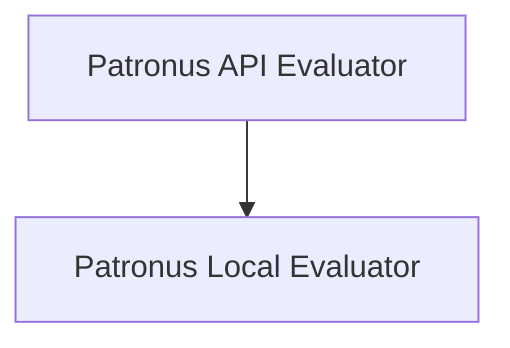

# Patronus Evaluation Tools

The `patronus_eval_tools` module provides a suite of tools for evaluating AI model inputs and outputs, integrating with the Patronus AI platform for both API-based and local evaluations. These tools are crucial for ensuring the quality and performance of AI agents by allowing developers to define and apply various evaluation criteria.

## Architecture Overview

The `patronus_eval_tools` module is structured into two main sub-modules:

1. **[Patronus API Evaluator](patronus_api_evaluator.md)**: Handles evaluations through the Patronus AI API, supporting both dynamic selection of evaluators and predefined criteria.
2. **[Patronus Local Evaluator](patronus_local_evaluator.md)**: Facilitates local evaluation using custom function evaluators.

<!-- DIAGRAM_JSON
{
    "direction": "TD",
    "nodes": [
        {"id": "patronus_api_evaluator", "label": "Patronus API Evaluator", "type": "module", "link": "patronus_api_evaluator.md"},
        {"id": "patronus_local_evaluator", "label": "Patronus Local Evaluator", "type": "module", "link": "patronus_local_evaluator.md"}
    ],
    "edges": [
        {"source": "patronus_api_evaluator", "target": "patronus_local_evaluator"}
    ],
    "groups": []
}
-->

