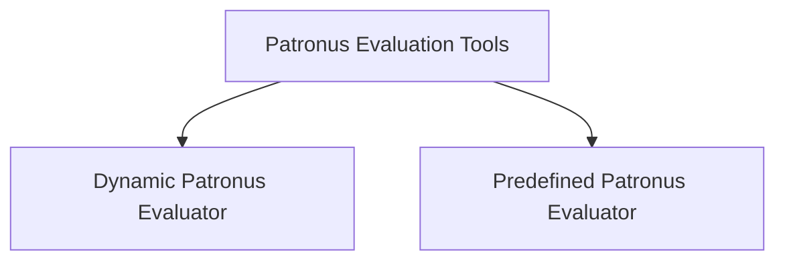

# Patronus Evaluation Tools Module

## Introduction
The `patronus_evaluation_tools` module provides a set of tools for integrating with the Patronus AI evaluation platform. These tools enable agents to evaluate model inputs and outputs against various criteria, either by dynamically selecting evaluators or by using predefined evaluation criteria.

## Architecture Overview
The module consists of two main sub-modules: `patronus_dynamic_evaluator_tool` and `patronus_predefined_evaluator_tool`. Both tools interact with the external Patronus AI API for performing evaluations.

## Sub-modules

*   **[Dynamic Patronus Evaluator](patronus_dynamic_evaluator_tool.md)**: This sub-module contains the `PatronusEvalTool`, which allows agents to select the most appropriate evaluators and criteria dynamically from the Patronus API for a given evaluation task.
*   **[Predefined Patronus Evaluator](patronus_predefined_evaluator_tool.md)**: This sub-module provides the `PatronusPredefinedCriteriaEvalTool`, designed for evaluating model interactions against a fixed set of predefined Patronus evaluators and criteria, offering more controlled evaluation workflows.

## Architecture Diagram
<!-- DIAGRAM_JSON
{
    "direction": "TD",
    "nodes": [
        {"id": "patronus_evaluation_tools", "label": "Patronus Evaluation Tools", "type": "module"},
        {"id": "patronus_dynamic_evaluator_tool", "label": "Dynamic Patronus Evaluator", "type": "module", "link": "patronus_dynamic_evaluator_tool.md"},
        {"id": "patronus_predefined_evaluator_tool", "label": "Predefined Patronus Evaluator", "type": "module", "link": "patronus_predefined_evaluator_tool.md"}
    ],
    "edges": [
        {"source": "patronus_evaluation_tools", "target": "patronus_dynamic_evaluator_tool"},
        {"source": "patronus_evaluation_tools", "target": "patronus_predefined_evaluator_tool"}
    ],
    "groups": []
}
-->
