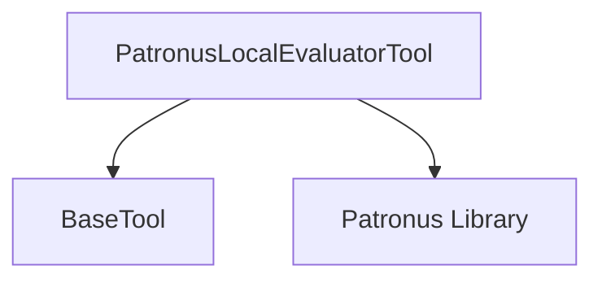

# patronus_local_evaluator

The `patronus_local_evaluator` module provides a tool for locally evaluating model inputs and outputs using custom function evaluators powered by the Patronus library. This module is essential for integrating custom evaluation logic directly into CrewAI workflows, allowing for real-time feedback and quality assurance.

## Architecture

The `patronus_local_evaluator` module consists primarily of the `PatronusLocalEvaluatorTool`. This tool inherits from the [BaseTool](crewai_tool_base.md) provided by CrewAI and interacts with the external Patronus library to perform evaluations.

<!-- DIAGRAM_JSON
{
    "direction": "TD",
    "nodes": [
        {"id": "patronus_local_evaluator_tool", "label": "PatronusLocalEvaluatorTool", "type": "component", "link": null},
        {"id": "base_tool", "label": "BaseTool", "type": "external", "link": "crewai_tool_base.md"},
        {"id": "patronus_library", "label": "Patronus Library", "type": "external", "link": null}
    ],
    "edges": [
        {"source": "patronus_local_evaluator_tool", "target": "base_tool"},
        {"source": "patronus_local_evaluator_tool", "target": "patronus_library"}
    ],
    "groups": []
}
-->


### Component: `PatronusLocalEvaluatorTool`

`PatronusLocalEvaluatorTool` is a specialized tool designed to facilitate local evaluation of AI model interactions. It integrates with the Patronus evaluation framework to apply custom evaluation functions.

**Key Features:**
- **Custom Function Evaluation:** Allows users to define and utilize custom Python functions as evaluators.
- **Dynamic Dependency Installation:** Automatically prompts for `patronus` package installation if missing.
- **Flexible Input Parameters:** Evaluates based on `evaluated_model_input`, `evaluated_model_output`, `evaluated_model_retrieved_context`, and a `evaluated_model_gold_answer`.

**Usage:**

The tool is initialized with an `evaluator` (the name of the custom Patronus evaluation function) and an `evaluated_model_gold_answer`. During execution, it leverages a `patronus_client` to perform the evaluation.

```python
class PatronusLocalEvaluatorTool(BaseTool):
    # ... (attributes and initialization)

    def _initialize_patronus(self, patronus_client: Any) -> None:
        # Handles Patronus client initialization and dependency check
        pass

    def _run(
        self,
        **kwargs: Any,
    ) -> Any:
        # Extracts evaluation parameters from kwargs
        # Calls self.client.evaluate and formats the result
        pass
```

## Relationships to Other Modules

This module is a part of the `patronus_eval_tools` submodule, which is nested under `crewai_tools_platform_automation`. It depends on the base tool functionalities provided by [crewai_tool_base](crewai_tool_base.md). It offers a specialized evaluation capability that can be integrated into broader CrewAI workflows where model output assessment is required.
