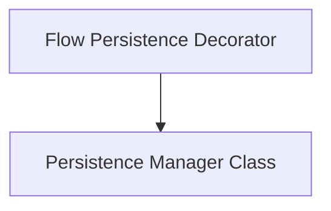

# Persistence Handlers Module

The `persistence_handlers` module is responsible for managing the persistence of CrewAI Flow states. It provides decorators to automatically save the state of Flow instances and their methods, ensuring data integrity and enabling features like resuming flows or auditing execution.

## Architecture Overview

This module is composed of two main components:

*   **Flow Persistence Decorator (`persistence_decorator_logic.md`)**: This sub-module contains the core decorator logic that wraps Flow classes and methods to inject persistence functionality.
*   **Persistence Manager Class (`persistence_manager_class.md`)**: This sub-module defines the `PersistenceDecorator` class, which encapsulates the actual state saving mechanism, including error handling and logging.

These components work together to provide a robust and extensible system for persisting Flow states.

<!-- DIAGRAM_JSON
{
    "direction": "TD",
    "nodes": [
        {"id": "persistence_decorator_logic", "label": "Flow Persistence Decorator", "type": "module", "link": "persistence_decorator_logic.md"},
        {"id": "persistence_manager_class", "label": "Persistence Manager Class", "type": "module", "link": "persistence_manager_class.md"}
    ],
    "edges": [
        {"source": "persistence_decorator_logic", "target": "persistence_manager_class"}
    ],
    "groups": []
}
-->

