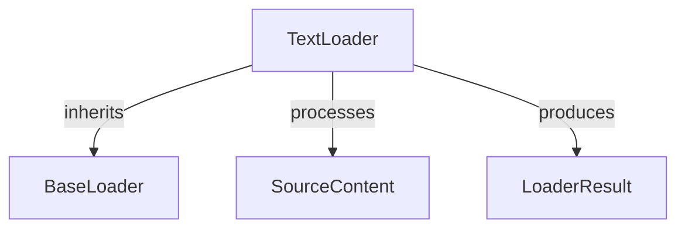

# `plain_text_loader` Module Documentation

## Introduction

The `plain_text_loader` module is a vital component within the `crewai_tools` ecosystem, specifically designed for the Retrieval Augmented Generation (RAG) system. Its primary function is to efficiently load plain text content into a standardized `LoaderResult` format, making it readily available for further processing within RAG pipelines.

This module encapsulates the `TextLoader` class, which provides a straightforward and robust mechanism for ingesting raw text data. It is particularly useful for scenarios where content is directly provided as a string and needs to be treated as a single document.

## Architecture and Component Relationships

The `plain_text_loader` module primarily consists of the `TextLoader` component. It extends `BaseLoader` and interacts with `SourceContent` for input and produces `LoaderResult` as output. These foundational components (BaseLoader, SourceContent, LoaderResult) are part of the `base_components` module within the RAG loaders and chunkers, ensuring a consistent interface across different data loaders.

<!-- DIAGRAM_JSON
{
    "direction": "TD",
    "nodes": [
        {"id": "text_loader", "label": "TextLoader", "type": "component", "link": null},
        {"id": "base_loader", "label": "BaseLoader", "type": "external", "link": "crewai_tools_rag_loaders_and_chunkers_base_components.md"},
        {"id": "source_content", "label": "SourceContent", "type": "external", "link": "crewai_tools_rag_loaders_and_chunkers_base_components.md"},
        {"id": "loader_result", "label": "LoaderResult", "type": "external", "link": "crewai_tools_rag_loaders_and_chunkers_base_components.md"}
    ],
    "edges": [
        {"source": "text_loader", "target": "base_loader", "label": "inherits"},
        {"source": "text_loader", "target": "source_content", "label": "processes"},
        {"source": "text_loader", "target": "loader_result", "label": "produces"}
    ],
    "groups": []
}
-->

## Core Functionality

### `TextLoader` Class

-   **Purpose**: The `TextLoader` class is responsible for loading raw text content.
-   **Method**: `load(self, source_content: SourceContent, **kwargs: Any) -> LoaderResult`
    -   **Parameters**:
        -   `source_content` (`SourceContent`): An object containing the raw text (`source`) and its reference (`source_ref`).
        -   `**kwargs` (`Any`): Additional keyword arguments that might be passed (currently not explicitly used).
    -   **Returns**:
        -   `LoaderResult`: An object containing the loaded `content` (the raw text), its `source` reference, and a generated `doc_id`.
    -   **Description**: This method takes a `SourceContent` object, extracts the plain text from its `source` attribute, and encapsulates it within a `LoaderResult` along with its original reference and a unique document ID generated based on the content.

## Module Integration

The `plain_text_loader` module is situated within the `crewai_tools.rag.loaders.utility_loaders` package. It serves as a fundamental utility loader, enabling the RAG system to consume simple, unformatted text input. Its integration is seamless with other components of the RAG system, particularly with the chunkers and other processing modules that expect data in the `LoaderResult` format.

It plays a crucial role in the broader `crewai_tools_rag_loaders_and_chunkers` module by providing a basic text loading capability that can be combined with more complex loaders or used independently for straightforward text ingestion tasks.

