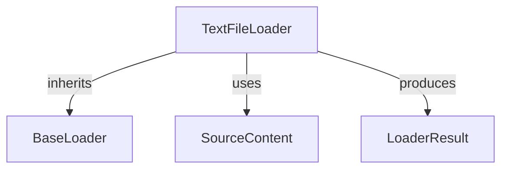

# Module: plain_text_loaders

## Introduction
The `plain_text_loaders` module is a vital part of the CrewAI RAG (Retrieval Augmented Generation) system, specifically designed for handling and loading plain text files. It provides a straightforward mechanism to ingest textual data, making it accessible for further processing within the RAG pipeline.

## Purpose and Core Functionality
This module's primary purpose is to efficiently load content from plain text files. Its core functionality revolves around the `TextFileLoader` component, which reads the content of a specified text file and encapsulates it into a `LoaderResult` object. This makes it easy for other parts of the RAG system to consume and process the textual data.

## Architecture and Component Relationships

<!-- DIAGRAM_JSON
{
    "direction": "TD",
    "nodes": [
        {"id": "text_file_loader", "label": "TextFileLoader", "type": "component", "link": null},
        {"id": "base_loader", "label": "BaseLoader", "type": "external", "link": "base_components.md"},
        {"id": "source_content", "label": "SourceContent", "type": "external", "link": "base_components.md"},
        {"id": "loader_result", "label": "LoaderResult", "type": "external", "link": "base_components.md"}
    ],
    "edges": [
        {"source": "text_file_loader", "target": "base_loader", "label": "inherits"},
        {"source": "text_file_loader", "target": "source_content", "label": "uses"},
        {"source": "text_file_loader", "target": "loader_result", "label": "produces"}
    ],
    "groups": []
}
-->

### Components

#### `TextFileLoader`
-   **Description**: Implements the logic for loading plain text files. It extends the `BaseLoader` to conform to the RAG loader interface.
-   **Key Functionality**:
    -   Validates the existence of the specified file path.
    -   Reads the entire content of a plain text file using UTF-8 encoding.
    -   Constructs a `LoaderResult` object containing the file's content, source reference, and a unique document ID.

### External Dependencies
-   **`base_components`**: This module (located within `crewai_tools_rag_loaders_and_chunkers`) provides the foundational interfaces and data structures for all RAG loaders. `TextFileLoader` inherits from `BaseLoader` and utilizes `SourceContent` and `LoaderResult` from this module to ensure consistent data handling across the RAG system.
    -   [base_components](base_components.md)

## How the Module Fits into the Overall System
The `plain_text_loaders` module is a specific implementation within the broader `file_loaders` category, which itself is part of the `data_loaders` sub-module under `crewai_tools_rag_loaders_and_chunkers`. Its role is crucial for ingesting unstructured text data directly from files.

In the CrewAI RAG system, agents often need to process information from various sources. This module enables the system to effortlessly read plain text documents, allowing the content to be chunked, indexed, and retrieved as part of the RAG process. By providing a dedicated loader for plain text, it ensures that this common data format is well-supported, contributing to the versatility and robustness of the RAG capabilities. It works in conjunction with other loaders to provide a comprehensive data ingestion layer for the CrewAI framework.