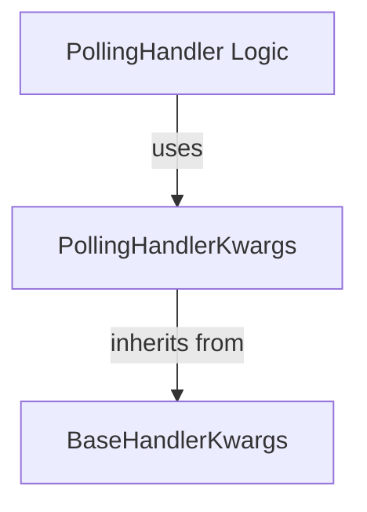

# polling_handler_kwargs

## Introduction
The `polling_handler_kwargs` module defines the `PollingHandlerKwargs` TypedDict, which encapsulates the configuration parameters for polling-based update handlers within the Agent-to-Agent (A2A) communication system. These parameters govern the behavior of how agents poll for updates, including polling intervals, timeouts, and history management.

## Architecture and Component Relationships

<!-- DIAGRAM_JSON
{
    "direction": "TD",
    "nodes": [
        {"id": "polling_handler_kwargs", "label": "PollingHandlerKwargs", "type": "component", "link": null},
        {"id": "base_handler_kwargs", "label": "BaseHandlerKwargs", "type": "external", "link": "a2a_update_handlers.md"},
        {"id": "polling_handler_logic", "label": "PollingHandler Logic", "type": "external", "link": "polling_handler_logic.md"}
    ],
    "edges": [
        {"source": "polling_handler_kwargs", "target": "base_handler_kwargs", "label": "inherits from"},
        {"source": "polling_handler_logic", "target": "polling_handler_kwargs", "label": "uses"}
    ],
    "groups": []
}
-->

## Core Functionality

The `PollingHandlerKwargs` TypedDict provides the following configuration options for polling handlers:

*   `polling_interval`: The time (in seconds) to wait between polling attempts.
*   `polling_timeout`: The maximum duration (in seconds) to wait for a polling response.
*   `history_length`: The number of past updates to retain in the polling history.
*   `max_polls`: An optional maximum number of polling attempts.

## How it Fits into the Overall System
The `polling_handler_kwargs` module is a crucial part of the [crewai_agent_to_agent_communication](crewai_agent_to_agent_communication.md) framework, specifically within the update handling mechanism. It serves as the configuration blueprint for the [polling_handler_logic](polling_handler_logic.md) module, which implements the actual polling behavior. By centralizing these configuration parameters, the module ensures consistent and manageable control over how agents retrieve updates, contributing to the robustness and flexibility of inter-agent communication. It works in conjunction with other update handlers, such as [streaming_handlers](streaming_handlers.md) and [push_notification_handlers](push_notification_handlers.md), to provide a comprehensive update delivery system.
