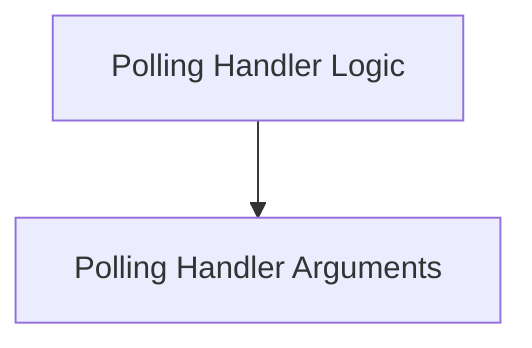

# Polling Handlers Module

## Introduction

The `polling_handlers` module is responsible for managing agent-to-agent (A2A) communication updates through a polling mechanism. It provides the necessary configuration and execution logic for agents to asynchronously retrieve updates from other agents, ensuring efficient and reliable information exchange within a multi-agent system.

## Architecture Overview

The module consists of two main components: `PollingHandlerKwargs` for configuration and `PollingHandler` for the core execution logic. It integrates with the A2A client for message exchange and the CrewAI event bus for logging and event emission.

<!-- DIAGRAM_JSON
{
    "direction": "TD",
    "nodes": [
        {"id": "polling_handler_kwargs", "label": "Polling Handler Arguments", "type": "module", "link": "polling_handler_kwargs.md"},
        {"id": "polling_handler_logic", "label": "Polling Handler Logic", "type": "module", "link": "polling_handler_logic.md"}
    ],
    "edges": [
        {"source": "polling_handler_logic", "target": "polling_handler_kwargs"}
    ],
    "groups": []
}
-->

## Sub-modules

*   [Polling Handler Arguments](polling_handler_kwargs.md): Defines the configuration parameters for the polling mechanism.
*   [Polling Handler Logic](polling_handler_logic.md): Contains the core implementation for executing polling-based updates.