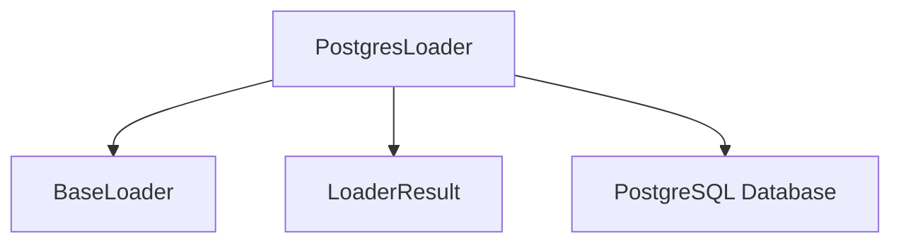

# postgres_loader

## Introduction
The `postgres_loader` module provides a specialized loader for extracting data from PostgreSQL databases. It is part of the `database_loaders` sub-module within the larger `crewai_tools_rag_loaders_and_chunkers` module, designed to facilitate the integration of PostgreSQL data into RAG (Retrieval Augmented Generation) systems.

## Purpose and Core Functionality
The primary purpose of this module is to enable CrewAI agents to retrieve structured and unstructured content directly from PostgreSQL databases using SQL queries. The `PostgresLoader` class handles the connection, query execution, and formatting of results into a standardized `LoaderResult` object.

### Core Component: `PostgresLoader`
The `PostgresLoader` class is responsible for the following:
-   **Database Connection**: Establishes a connection to a PostgreSQL database using a provided connection URI.
-   **Query Execution**: Executes a given SQL query against the connected database.
-   **Data Retrieval**: Fetches all rows returned by the query.
-   **Content Formatting**: Formats the retrieved data (columns and rows) into a human-readable string, including metadata such as column names, row count, and the database name.
-   **Error Handling**: Manages exceptions related to invalid database URIs, connection failures, or query execution errors.
-   **Document ID Generation**: Generates a unique document ID for the loaded content, ensuring traceability.
-   **Content Truncation**: Truncates large content strings to prevent excessive size, appending a truncation notice.

### `load` Method
The `load` method is the entry point for data retrieval. It expects a `SourceContent` object containing the SQL query and requires a `db_uri` within the `metadata` kwargs for database connection.

```python
class PostgresLoader(BaseLoader):
    def load(self, source: SourceContent, **kwargs: Any) -> LoaderResult:
        # ... (implementation details)
```

## Architecture and Component Relationships

<!-- DIAGRAM_JSON
{
    "direction": "TD",
    "nodes": [
        {"id": "PostgresLoader", "label": "PostgresLoader", "type": "component", "link": null},
        {"id": "BaseLoader", "label": "BaseLoader", "type": "external", "link": "base_components.md"},
        {"id": "LoaderResult", "label": "LoaderResult", "type": "external", "link": "base_components.md"},
        {"id": "PostgreSQL_DB", "label": "PostgreSQL Database", "type": "external", "link": null}
    ],
    "edges": [
        {"source": "PostgresLoader", "target": "BaseLoader"},
        {"source": "PostgresLoader", "target": "LoaderResult"},
        {"source": "PostgresLoader", "target": "PostgreSQL_DB"}
    ],
    "groups": []
}
-->


The `PostgresLoader` is a concrete implementation of the abstract `BaseLoader` class. It utilizes the `LoaderResult` data structure to encapsulate the loaded content and its associated metadata. The module directly interacts with an external `PostgreSQL Database` to fetch the data.

## How the Module Fits into the Overall System
The `postgres_loader` module is a vital part of the `crewai_tools_rag_loaders_and_chunkers.database_loaders` sub-module. It provides a specific mechanism for agents to ingest data from PostgreSQL, complementing other database loaders like `mysql_loader`. This integration allows CrewAI agents to access and process information stored in relational databases, enriching their knowledge base for RAG applications.

By abstracting the database interaction behind the `BaseLoader` interface, `postgres_loader` contributes to a modular and extensible data loading system within CrewAI. Agents can seamlessly switch between different data sources (web, files, various databases) without requiring significant changes to their core logic, promoting flexibility and reusability across diverse RAG scenarios.