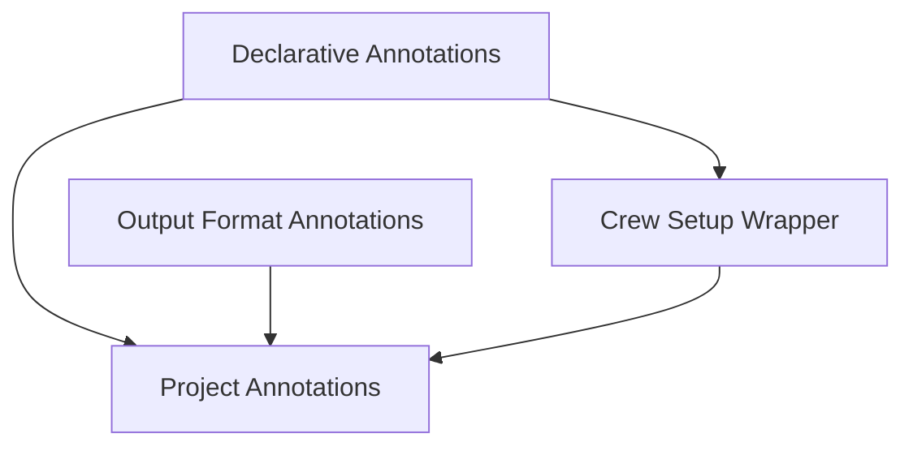

# Project Annotations Module

## Introduction

The `project_annotations` module, part of the `crewai_project_structure`, provides a set of powerful decorators and a core wrapper for defining and managing the components of a CrewAI project. It simplifies the process of declaring tasks, agents, LLMs, tools, cache handlers, and event hooks, ensuring proper instantiation and execution flow.

## Architecture

The `project_annotations` module is structured around declarative annotations that define various components and a central wrapper that orchestrates their setup and execution within a CrewAI project. It interacts with other modules by providing the foundational structure for agents, tasks, and event handling.

<!-- DIAGRAM_JSON
{
    "direction": "TD",
    "nodes": [
        {"id": "project_annotations", "label": "Project Annotations", "type": "module"},
        {"id": "declarative_annotations", "label": "Declarative Annotations", "type": "module", "link": "declarative_annotations.md"},
        {"id": "output_annotations", "label": "Output Format Annotations", "type": "module", "link": "output_annotations.md"},
        {"id": "crew_setup_wrapper", "label": "Crew Setup Wrapper", "type": "module", "link": "crew_setup_wrapper.md"}
    ],
    "edges": [
        {"source": "declarative_annotations", "target": "project_annotations"},
        {"source": "output_annotations", "target": "project_annotations"},
        {"source": "crew_setup_wrapper", "target": "project_annotations"},
        {"source": "declarative_annotations", "target": "crew_setup_wrapper"}
    ],
    "groups": []
}
-->

## Sub-modules

This module contains the following sub-modules:

*   **[Declarative Annotations](declarative_annotations.md)**: Handles the definition of various project components like tasks, agents, LLMs, tools, and lifecycle hooks through decorators.
*   **[Output Format Annotations](output_annotations.md)**: Manages annotations for specifying output formats, such as JSON or Pydantic models.
*   **[Crew Setup Wrapper](crew_setup_wrapper.md)**: Orchestrates the initialization of the Crew instance, including agent and task instantiation, and the attachment of `before_kickoff` and `after_kickoff` callbacks.`