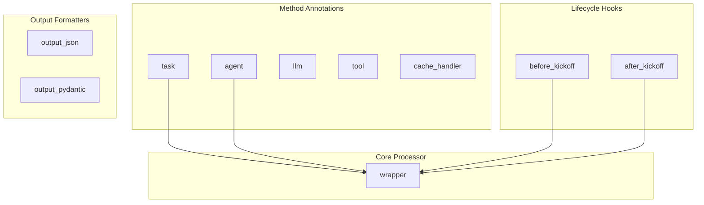

# project_annotations
This module provides decorators for marking methods and classes within a CrewAI project, defining their roles as tasks, agents, tools, LLMs, cache handlers, or lifecycle hooks, and specifying output formats. It centralizes the definition and processing of project components.

<!-- DIAGRAM_JSON
{
    "nodes": [
        {
            "id": "task",
            "label": "task"
        },
        {
            "id": "agent",
            "label": "agent"
        },
        {
            "id": "llm",
            "label": "llm"
        },
        {
            "id": "tool",
            "label": "tool"
        },
        {
            "id": "cache_handler",
            "label": "cache_handler"
        },
        {
            "id": "before_kickoff",
            "label": "before_kickoff"
        },
        {
            "id": "after_kickoff",
            "label": "after_kickoff"
        },
        {
            "id": "output_json",
            "label": "output_json"
        },
        {
            "id": "output_pydantic",
            "label": "output_pydantic"
        },
        {
            "id": "wrapper",
            "label": "wrapper"
        }
    ],
    "edges": [
        {
            "source": "task",
            "target": "wrapper",
            "label": "processes"
        },
        {
            "source": "agent",
            "target": "wrapper",
            "label": "processes"
        },
        {
            "source": "before_kickoff",
            "target": "wrapper",
            "label": "processes"
        },
        {
            "source": "after_kickoff",
            "target": "wrapper",
            "label": "processes"
        }
    ],
    "groups": [
        {
            "id": "method_annotations",
            "label": "Method Annotations",
            "nodes": [
                "task",
                "agent",
                "llm",
                "tool",
                "cache_handler"
            ]
        },
        {
            "id": "lifecycle_hooks",
            "label": "Lifecycle Hooks",
            "nodes": [
                "before_kickoff",
                "after_kickoff"
            ]
        },
        {
            "id": "output_formatters",
            "label": "Output Formatters",
            "nodes": [
                "output_json",
                "output_pydantic"
            ]
        },
        {
            "id": "core_processor",
            "label": "Core Processor",
            "nodes": [
                "wrapper"
            ]
        }
    ]
}
-->
