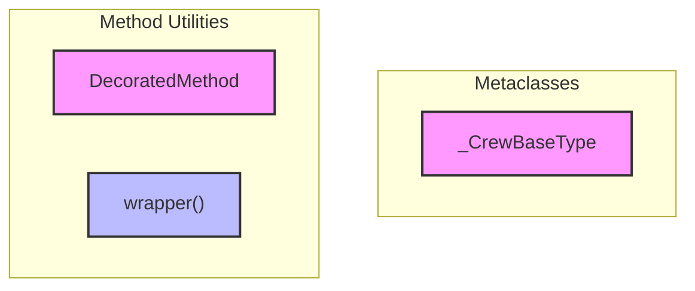

# project_core
The `project_core` module provides foundational components for class metaprogramming and method decoration, including a metaclass for base types and utilities for wrapping methods with metadata and caching.

<!-- DIAGRAM_JSON
{
  "nodes": [
    {"id": "_CrewBaseType", "label": "_CrewBaseType", "type": "class"},
    {"id": "DecoratedMethod", "label": "DecoratedMethod", "type": "class"},
    {"id": "wrapper", "label": "wrapper", "type": "function"}
  ],
  "edges": [],
  "groups": [
    {"id": "Metaclasses", "label": "Metaclasses", "nodes": ["_CrewBaseType"]},
    {"id": "Method Utilities", "label": "Method Utilities", "nodes": ["DecoratedMethod", "wrapper"]}
  ]
}
-->
