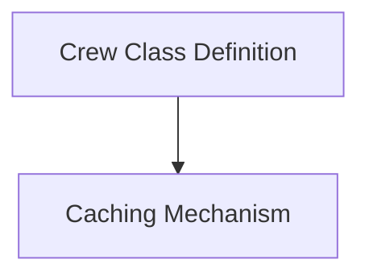

# Project Core Mechanisms

The `project_core_mechanisms` module under `crewai_project_structure` encapsulates fundamental functionalities essential for defining and managing CrewAI projects. It provides the underlying architecture for method decoration, class definition, and performance optimization through caching.

## Architecture Overview

This module is composed of two primary sub-modules:

<!-- DIAGRAM_JSON
{
    "direction": "TD",
    "nodes": [
        {"id": "crew_class_definition", "label": "Crew Class Definition", "type": "module", "link": "crew_class_definition.md"},
        {"id": "caching_mechanism", "label": "Caching Mechanism", "type": "module", "link": "caching_mechanism.md"}
    ],
    "edges": [
        {"source": "crew_class_definition", "target": "caching_mechanism"}
    ],
    "groups": []
}
-->

## Sub-modules

### [Crew Class Definition](crew_class_definition.md)
This sub-module is responsible for the foundational aspects of defining Crew classes and their associated methods. It includes mechanisms for transforming classes into callable decorators and for attaching metadata to methods while preserving their original signatures.

### [Caching Mechanism](caching_mechanism.md)
This sub-module provides an asynchronous caching wrapper to enhance the performance of methods. It efficiently stores and retrieves results from a cache, reducing redundant computations and improving response times.