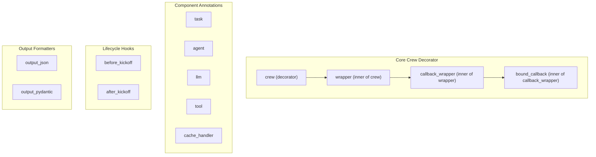

# project_structure
This module provides decorators for defining and configuring components within a crewai project, including tasks, agents, LLMs, tools, cache handlers, lifecycle hooks, and output formats.

<!-- DIAGRAM_JSON
{
  "nodes": [
    { "id": "task", "label": "task" },
    { "id": "agent", "label": "agent" },
    { "id": "llm", "label": "llm" },
    { "id": "tool", "label": "tool" },
    { "id": "cache_handler", "label": "cache_handler" },
    { "id": "before_kickoff", "label": "before_kickoff" },
    { "id": "after_kickoff", "label": "after_kickoff" },
    { "id": "output_json", "label": "output_json" },
    { "id": "output_pydantic", "label": "output_pydantic" },
    { "id": "crew", "label": "crew (decorator)" },
    { "id": "wrapper", "label": "wrapper (inner of crew)" },
    { "id": "callback_wrapper", "label": "callback_wrapper (inner of wrapper)" },
    { "id": "bound_callback", "label": "bound_callback (inner of callback_wrapper)" }
  ],
  "edges": [
    { "source": "crew", "target": "wrapper", "label": "contains" },
    { "source": "wrapper", "target": "callback_wrapper", "label": "uses" },
    { "source": "callback_wrapper", "target": "bound_callback", "label": "uses" }
  ],
  "groups": [
    {
      "id": "core_crew_decorator",
      "label": "Core Crew Decorator",
      "nodes": ["crew", "wrapper", "callback_wrapper", "bound_callback"]
    },
    {
      "id": "component_annotations",
      "label": "Component Annotations",
      "nodes": ["task", "agent", "llm", "tool", "cache_handler"]
    },
    {
      "id": "lifecycle_hooks",
      "label": "Lifecycle Hooks",
      "nodes": ["before_kickoff", "after_kickoff"]
    },
    {
      "id": "output_formatters",
      "label": "Output Formatters",
      "nodes": ["output_json", "output_pydantic"]
    }
  ]
}
-->
