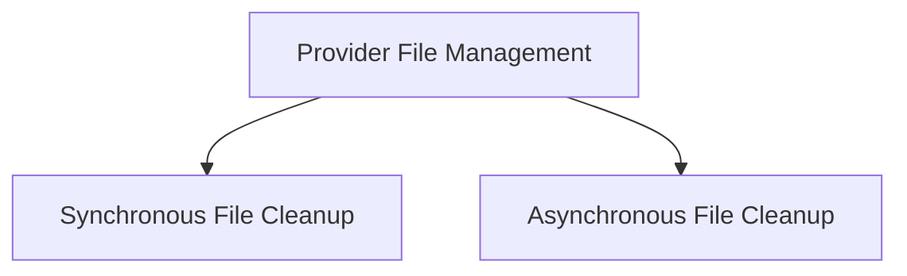

# Provider File Management Module

## Introduction and Purpose
The `provider_file_management` module is responsible for handling the cleanup of files managed by various providers and stored in the application's cache. It provides a robust mechanism to ensure that files are deleted from both the cache and the respective cloud storage providers, supporting both synchronous and asynchronous cleanup operations. This helps in managing storage, complying with data retention policies, and optimizing resource usage.

## Architecture Overview
The module is structured to clearly separate synchronous and asynchronous file cleanup responsibilities. It interacts with the `crewai_files_uploaders` module to get appropriate file uploaders for different providers and with the `crewai_files_cache` module for managing cached file information.

<!-- DIAGRAM_JSON
{
    "direction": "TD",
    "nodes": [
        {"id": "provider_file_management_main", "label": "Provider File Management", "type": "module"},
        {"id": "sync_file_cleanup", "label": "Synchronous File Cleanup", "type": "module", "link": "sync_file_cleanup.md"},
        {"id": "async_file_cleanup", "label": "Asynchronous File Cleanup", "type": "module", "link": "async_file_cleanup.md"}
    ],
    "edges": [
        {"source": "provider_file_management_main", "target": "sync_file_cleanup"},
        {"source": "provider_file_management_main", "target": "async_file_cleanup"}
    ],
    "groups": []
}
-->

## High-Level Functionality

### Synchronous File Cleanup
This sub-module provides the core synchronous functionality for cleaning up files. It allows for the deletion of files associated with a specific provider, either by clearing only cached entries or by performing a comprehensive deletion of all files from the provider's storage.
For more details, refer to the [Synchronous File Cleanup](sync_file_cleanup.md) documentation.

### Asynchronous File Cleanup
This sub-module offers asynchronous capabilities for managing file cleanup operations. It supports cleaning up provider-specific files and general uploaded files from the cache, leveraging concurrency for improved performance. This is particularly useful for large-scale cleanup tasks.
For more details, refer to the [Asynchronous File Cleanup](async_file_cleanup.md) documentation.
