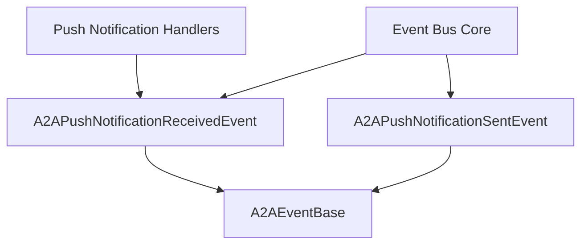

# `push_notification_events` Module Documentation

## Introduction

The `push_notification_events` module is a crucial component within the CrewAI event system, specifically designed to handle and define events related to Agent-to-Agent (A2A) push notifications. It provides standardized event structures for both receiving and sending push notifications between autonomous agents, facilitating asynchronous communication and task status updates.

## Architecture and Core Functionality

This module defines two primary event classes that serve as the backbone for push notification interactions in the A2A communication framework:

### `A2APushNotificationReceivedEvent`

This event is emitted when a push notification is successfully received by a client's webhook handler. It encapsulates all necessary information about the incoming notification, allowing the system to process the update and potentially store the result. Key attributes include the task ID, context ID, current task state, the sender's endpoint, the A2A agent's name, and any custom metadata.

**Purpose:** To signal the successful reception of a push notification and carry its payload for further processing, often preceding a call to `result_store.store_result()` within the receiving agent's logic.

### `A2APushNotificationSentEvent`

This event is emitted by the A2A server after it attempts to send a task status update to a client's registered push notification callback URL. It records the outcome of the notification delivery, including whether it was successful or if an error occurred. Attributes include the task ID, context ID, the callback URL used, the reported task state, a success flag, an optional error message, and custom metadata.

**Purpose:** To log and track the delivery status of outgoing push notifications, providing observability into the A2A communication flow.

### Relationship with other modules

-   **[a2a_events.md](a2a_events.md)**: This module is a sub-module of `a2a_events`, contributing specific event types for notifications within the broader A2A event categories.
-   **[push_notification_handlers.md](push_notification_handlers.md)**: The events defined here are typically processed by handlers in the `push_notification_handlers` module, which would contain the logic for acting upon received notifications or responding to sent notification outcomes.
-   **[event_bus_core.md](event_bus_core.md)**: These events are emitted and subscribed to through the central event bus managed by the `event_bus_core` module, which orchestrates the event-driven architecture of CrewAI.

## Module Diagram

<!-- DIAGRAM_JSON
{
    "direction": "TD",
    "nodes": [
        {"id": "A2APushNotificationReceivedEvent", "label": "A2APushNotificationReceivedEvent", "type": "component", "link": null},
        {"id": "A2APushNotificationSentEvent", "label": "A2APushNotificationSentEvent", "type": "component", "link": null},
        {"id": "A2AEventBase", "label": "A2AEventBase", "type": "external", "link": "a2a_events.md"},
        {"id": "PushNotificationHandlers", "label": "Push Notification Handlers", "type": "external", "link": "push_notification_handlers.md"},
        {"id": "EventBusCore", "label": "Event Bus Core", "type": "external", "link": "event_bus_core.md"}
    ],
    "edges": [
        {"source": "A2APushNotificationReceivedEvent", "target": "A2AEventBase"},
        {"source": "A2APushNotificationSentEvent", "target": "A2AEventBase"},
        {"source": "PushNotificationHandlers", "target": "A2APushNotificationReceivedEvent"},
        {"source": "EventBusCore", "target": "A2APushNotificationReceivedEvent"},
        {"source": "EventBusCore", "target": "A2APushNotificationSentEvent"}
    ],
    "groups": []
}
-->

