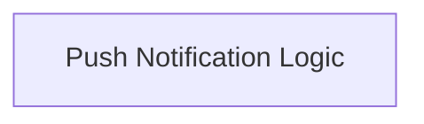

# Push Notification Handlers Module

## Introduction
This module is responsible for managing push notification-based updates within the Agent-to-Agent (A2A) communication system. It defines the necessary configurations and the handler logic for processing and orchestrating push notifications to ensure timely and reliable information exchange between agents.

## Architecture Overview
The `push_notification_handlers` module is a crucial part of the A2A update mechanism, working alongside polling and streaming handlers. It primarily interacts with the A2A client and a result store to handle outgoing messages and incoming push notifications, ensuring tasks are completed and results are properly recorded.

<!-- DIAGRAM_JSON
{
    "direction": "TD",
    "nodes": [
        {"id": "push_notification_logic", "label": "Push Notification Logic", "type": "module", "link": "push_notification_logic.md"}
    ],
    "edges": [],
    "groups": []
}
-->

## Sub-modules
*   [Push Notification Logic](push_notification_logic.md): Contains the core logic for handling push notifications, including defining the kwargs for the handler and the handler's execution logic.